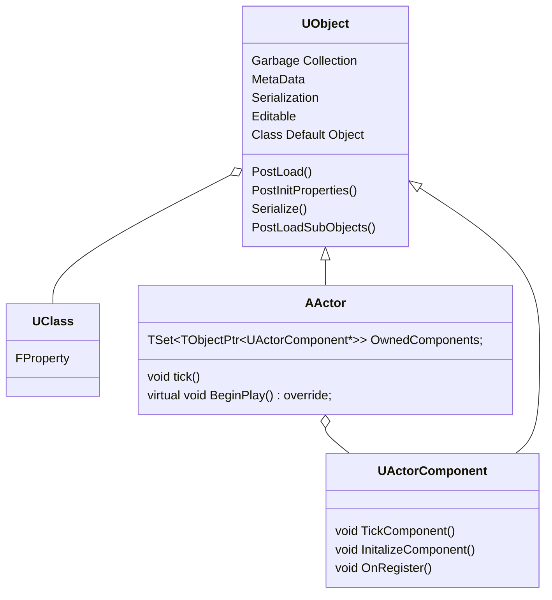
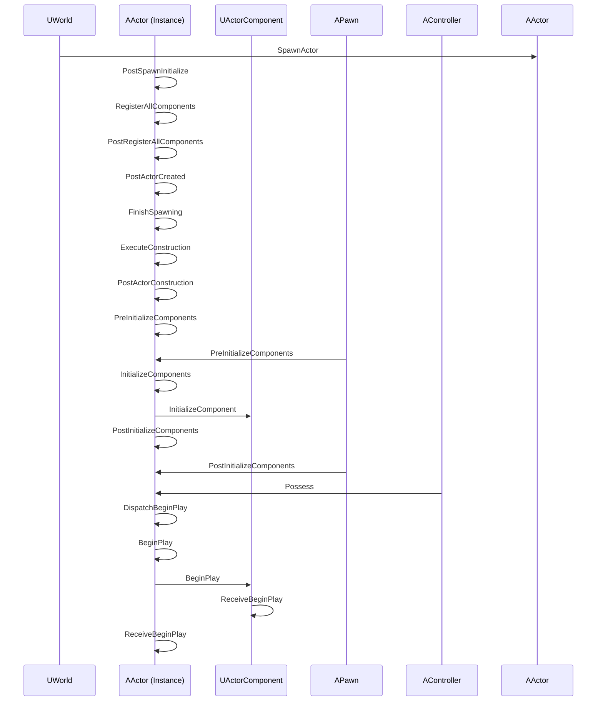
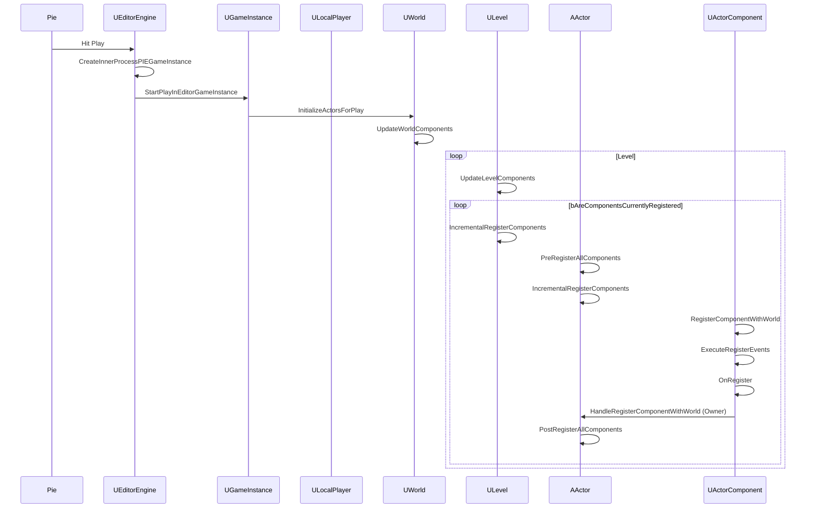
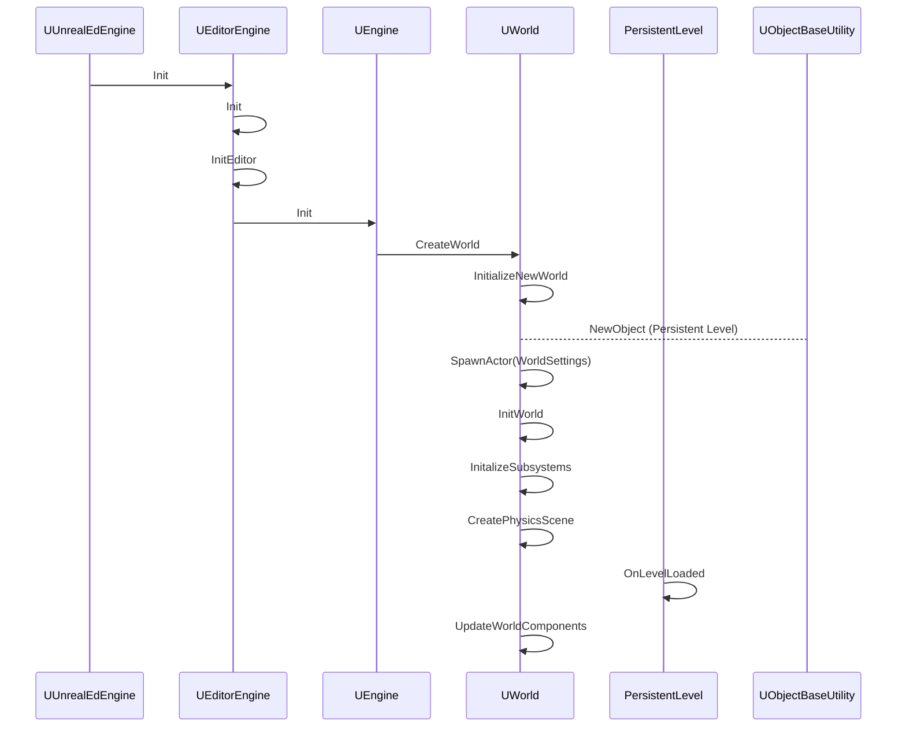
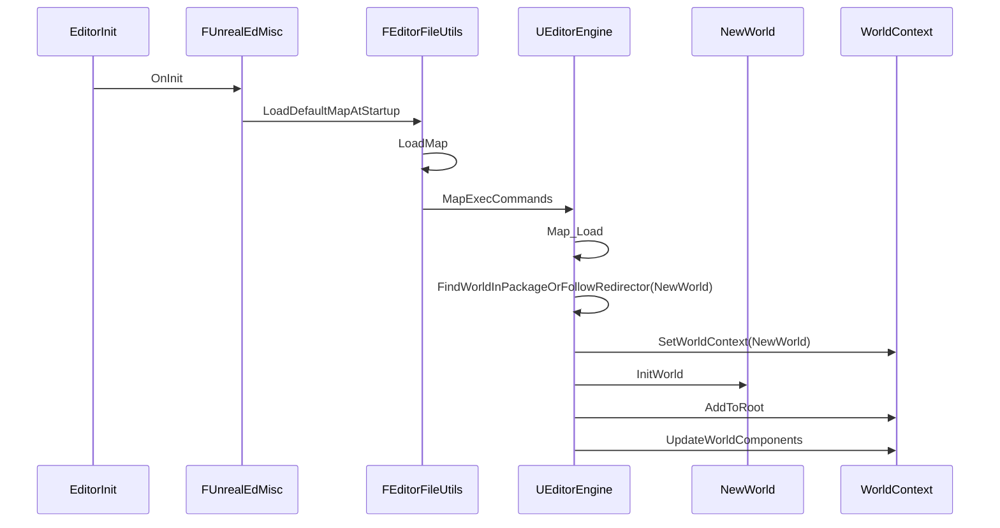
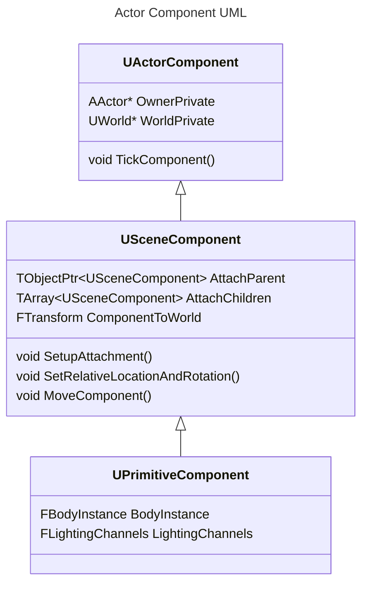
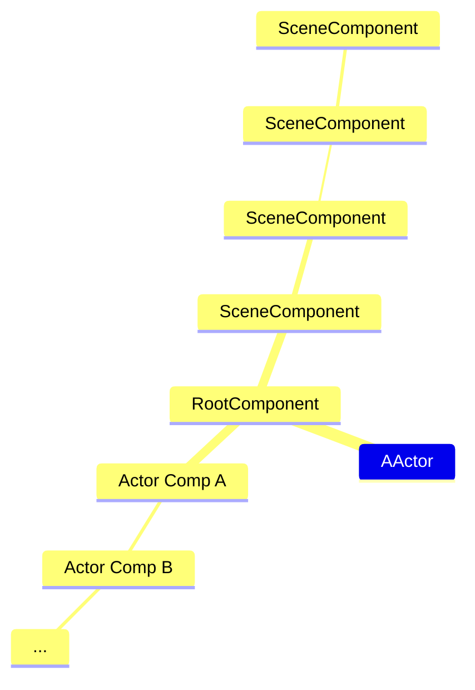

## Actors & Components

The base class for building out gameplay systems is `AActor`, along with any additional logic contained inside `Actor Components`. The design follows an `Entity Component` system where an Entity object in Unreal is `AActor`, and our component is `Actor Component`. `AActors` are designed to be containers for components, but at a lower level, an actor component is just another ordinary `UObject`. It's wrapped inside an `FProperty` and instantiated inside a `Main object` when marked inside a `UClass`. In Unreal Engine terminology, `Sub-Objects` refer to the different `FProperty` types that come from the `Reflection` system. When trying to segregate logic for an `Actor` into components, one might create a nested sub-object inside a component itself. While this works in most scenarios, it's not always the right choice due to the nature of Unreal's construction and initialization process. Behind the scenes, in a nested hierarchy of derived classes, the Construction/Post Initialization process is performed recursively with its class constructor and `FObjectInitializer` as a `Builder Pattern` object. To properly instantiate any nested properties within a `UClass`, a `Template` object (CDO) is created to hold the default state. This default state instanced object follows the `Prototype` pattern from which new instances copy default values. In the document `Unreal Engine UObject Construction & Post Initialization`, more details on this topic are provided.

The goal is to unravel the construction and initialization lifecycle of `AActors`, including how `UObject` post-initialization functions might be useful to override.

## AActor

Like everything at its core, `UObject` serves as the base for everything, including `AActor`. Therefore, it's relevant to briefly emphasize its importance when developing gameplay systems that derive from `AActor`. A rough UML diagram illustrating this relationship is shown below.



The Actor class isn't represented in a 3D world without a `SceneComponent`. Therefore, from a rendering perspective, it needs to carry its transformation matrix around to determine its position per frame. `AInfo` exist silently in the background while still being present in the level. If we need to move an actor, a `RootComponent` will automatically be set to be a `SceneComponent` behind the scenes. The `SceneComponent` exposes basic movement functionality that we can use to move our actors.

```cpp
bool AActor::SetActorLocation(const FVector& NewLocation, bool bSweep, FHitResult* OutSweepHitResult, ETeleportType Teleport)
{
    if (RootComponent)
    {
        const FVector Delta = NewLocation - GetActorLocation();
        return RootComponent->MoveComponent(Delta, GetActorQuat(), bSweep, OutSweepHitResult, MOVECOMP_NoFlags, Teleport);
    }
    else if (OutSweepHitResult)
    {
        *OutSweepHitResult = FHitResult();
    }
    return false;
}

```

Now it becomes interesting regarding the future of the `AActor` and `ActorComponent` design as a whole. Unreal Engine has begun to expand its utility beyond traditional FPS games, where the Actor Component system's performance was sufficient to handle updating transformations of hundreds of actors or more at runtime.

However, there are upcoming changes that I'd like to briefly acknowledge. The `Verse` scripting language is coming to Unreal Engine, promising gameplay programmers a functional programming language for coding gameplay and level systems. It introduces a separate garbage collector and a more data-driven programming approach, moving away from the traditional Object-Oriented programming model. This shift aligns Actors and Components towards an `ECS` (Entity Component System) direction, potentially raising the performance ceiling for active actors in a scene that can be updated per frame.

So, does this mean what I am currently learning will become obsolete? Well, sort of. The core objects in `Verse` will still depend on the reflection system and `UObject`, at least for now. `Verse` objects will copy the layout of a `UClass` into a data-driven memory layout used by the Verse VM. Thus, a significant rework of their reflection system is needed before they can move away from the core `UObject` architecture. Despite this, the concepts of the current Actor Component architecture will remain relevant to future systems, although it may take some time before it's fully implemented.

#### Actors and Component Life Cycle

If you've dug around like I have around the internet you've probably seen the Unreal Documentation provids this diagram.

![[AActorLifeCycle.png]](https://github.com/staticJPL/Unreal-Engine-Documentation/blob/509d9c6102868ec1f1b4975a86f37b4226b212c7/Unreal%20Engine%20Gameplay%20Architecture/Diagrams/AActorLifeCycle.png)

In the source code we also have some nice comments left inside Actor.h

```cpp
/**
 * Actor is the base class for an Object that can be placed or spawned in a level.
 * Actors may contain a collection of ActorComponents, which can be used to control how actors move, how they are rendered, etc.
 * The other main function of an Actor is the replication of properties and function calls across the network during play.
 *
 * Actor initialization has multiple steps, here's the order of important virtual functions that get called:
 * - UObject::PostLoad: For actors statically placed in a level, the normal UObject PostLoad gets called both in the editor and during gameplay.
 *                      This is not called for newly spawned actors.
 * - UActorComponent::OnComponentCreated: When an actor is spawned in the editor or during gameplay, this gets called for any native components.
 *                                        For blueprint-created components, this gets called during construction for that component.
 *                                        This is not called for components loaded from a level.
 * - AActor::PreRegisterAllComponents: For statically placed actors and spawned actors that have native root components, this gets called now.
 *                                     For blueprint actors without a native root component, these registration functions get called later during construction.
 * - UActorComponent::RegisterComponent: All components are registered in editor and at runtime, this creates their physical/visual representation.
 *                                       These calls may be distributed over multiple frames, but are always after PreRegisterAllComponents.
 *                                       This may also get called later on after an UnregisterComponent call removes it from the world.
 * - AActor::PostRegisterAllComponents: Called for all actors both in the editor and in gameplay, this is the last function that is called in all cases.
 * - AActor::PostActorCreated: When an actor is created in the editor or during gameplay, this gets called right before construction.
 *                             This is not called for components loaded from a level.
 * - AActor::UserConstructionScript: Called for blueprints that implement a construction script.
 * - AActor::OnConstruction: Called at the end of ExecuteConstruction, which calls the blueprint construction script.
 *                           This is called after all blueprint-created components are fully created and registered.
 *                           This is only called during gameplay for spawned actors, and may get rerun in the editor when changing blueprints.
 * - AActor::PreInitializeComponents: Called before InitializeComponent is called on the actor's components.
 *                                    This is only called during gameplay and in certain editor preview windows.
 * - UActorComponent::Activate: This will be called only if the component has bAutoActivate set.
 *                              It will also got called later on if a component is manually activated.
 * - UActorComponent::InitializeComponent: This will be called only if the component has bWantsInitializeComponentSet.
 *                                         This only happens once per gameplay session.
 * - AActor::PostInitializeComponents: Called after the actor's components have been initialized, only during gameplay and some editor previews.
 * - AActor::BeginPlay: Called when the level starts ticking, only during actual gameplay.
 *                      This normally happens right after PostInitializeComponents but can be delayed for networked or child actors.
 *
 * @see https://docs.unrealengine.com/Programming/UnrealArchitecture/Actors
 * @see https://docs.unrealengine.com/Programming/UnrealArchitecture/Actors/ActorLifecycle
 * @see UActorComponent
 */

```

`Ikrima.dev` also created a helpful table outlining where some key post-construction functions are called, including various registration functions for components.

| Actor Function              | Component Function                                          | On CDO? | On Level Load? | On Place In Level? | On Play? | On Spawn? | On Open Blueprint? |
| --------------------------- | ----------------------------------------------------------- | ------- | -------------- | ------------------ | -------- | --------- | ------------------ |
| `PostInitProperties`        | -                                                           | **_Y_** | **_Y_**        | **_Y_**            | **_Y_**  | **_Y_**   | **_Y_**            |
| `PostLoad`                  | -                                                           | **_Y_** | **_Y_**        | N                  | **_Y_**  | N         | N                  |
| `PostActorCreated`          | `OnComponentCreated`                                        | N       | N              | **_Y_**            | **_Y_**  | **_Y_**   | **_Y_**            |
| `PostRegisterAllComponents` | `OnRegister`                                                | N       | **_Y_**        | **_Y_**            | **_Y_**  | **_Y_**   | **_Y_**            |
| `PostInitializeComponents`  | `InitializeComponent iff bWantsInitializeComponent == true` | N       | N              | **_Y_**            | **_Y_**  | **_Y_**   | **_Y_**            |

That's great, and you've raised all these diagrams and comments, but the first question is: "Where should I write my object initialization code?" So, let's begin by discussing what `UObject` provides, namely the `Object Path`, `ObjectFlags`, and `ClassFlags`.

Every `UObject` possesses a unique path that serves to locate an instance, which either exists or is instantiated if not found. This unique path is serialized to facilitate `Pointer Swizzling`, a technique for reconstructing the object in memory when loading information about this object from disk.

For example:

`/Game/MyGame/MyAsset.MyAsset.ASubObjectOfMyAsset.AnotherObject`

If you split the path using dot as delimiter you will get:

1. /Game/MyGame/MyAsset  
2. MyAsset  
3. ASubObjectOfMyAsset  
4. AnotherObject

If you have read my earlier articles on `UObjects` and `Reflection`, you would already be familiar with the concept of the `Outer`. In this context, it represents `/Game/MyGame/MyAsset`, indicating the package to which an object belongs. Here are some `UClass` and `UObject` flags that are important to understand:


**Object Flags**

- `RF_Public`: The `UObject` is visible outside its package.
- `RF_Transactional`: The `UObject` is transactional, allowing it to be reverted in editor situations (e.g., Undo operations).
- `RF_StandAlone`: The `UObject` will not be discarded even if referenced by another object and is not garbage collected. It remains as long as the packages they're inside are loaded. If any packages they're inside are unloaded, the object will be eligible for garbage collection.
- `RF_ClassDefaultObject`: This `UObject` serves as a Default Object or Template Object.
- `RF_Archetype`: This `UObject` is a template object used for another object, allowing it to override the CDO (Class Default Object) or serve as a custom object that new instances can copy from.
- `RF_Transient`: The `UObject` is not serialized.
- `RF_NeedInitialization`: This flag indicates that the `FObjectInitializer` hasn't completed its initialization with the object.
- `RF_NeedPostLoad`: Some objects deserialized from disk require `PostLoad` to be called.
- `RF_DefaultSubObject`: Sub-object instances labeled with this flag ensure that Actor Components copy the correct template object defaults.

**Class Flags**

- `CLASS_Abstract`: This marks the class as abstract, meaning instances cannot be created from it. It's often used in situations resembling the factory pattern.
- `CLASS_Config`: Indicates that the class loads its configuration .ini file at construction time. Configuration files can be used to initialize defaults.
- `CLASS_Transient`: Marks the class as transient, indicating that it should not be serialized.
- `CLASS_Native`: This flag distinguishes between a pure C++ class object and a `UClassGenerated` object, which is associated with a blueprint.

#### UObject Construction & Initialization 

`UObject` defines a base default constructor where a function pointer is templated for derived types and stored early in the reflection process within `UClass`. The default constructor is responsible for creating our Class Default Object (CDO) and takes a constructor object parameter `FObjectInitializer`, which can be used to override default values. In addition to the default constructor, `PostInitProperties`, `PostLoad`, `PostLoadSubobject`, and certain editor-only functions can also be utilized to customize our gameplay objects.

#### PostInitProperties & Post Load

```cpp
UCLASS(Blueprintable)
class TestProj_API ATestActor : public AActor
{
    GENERATED_BODY()

public:
    UPROPERTY(EditAnywhere, BlueprintReadWrite, Category = "Test")
    int32 PostInitVal = 100;

public:
    /** Constructor. */
    UTestObject(const FObjectInitializer& ObjectInitializer);

    /** PostInitProperties override. */
    virtual void PostInitProperties() override;

    /** PostLoad override. */
    virtual void PostLoad() override;
};

```

```cpp
void ATestActor::PostInitProperties()  
{  
    Super::PostInitProperties();
	if (!HasAnyFlags(RF_ClassDefaultObject | RF_NeedLoad))  
	{  
	    PostInitVal = 120;  
	}
}
```


When the editor boots up, the default constructor is called during the initialization process. When `TestObject` is instantiated, the default constructor for `TestObject` is invoked.

```cpp
[Constructor]
     Object Path  = /Script/TestProj.Default__ATestActor
     Object Flags = Public ClassDefaultObject ArchetypeObject
     Class Flags  = Native RequiredAPI Intrinsic Constructed
     PostInitVal  = 100

[PostInitProperties] // BP_Instanced Dragged Actor
     Object Path  = /Script/TestProj.Default__ATestActor
     Object Flags = Public ClassDefaultObject ArchetypeObject
     Class Flags  = Native RequiredAPI Intrinsic Constructed
     PostInitVal  = 120
```

`PostInitProperties` overrides the `FProperty` `PostInitVal` to 120 when `TestActor` is dragged into the Level editor. In the Details Panel, you can revert the value for the instance of `TestActor` back to the CDO value of 100. Without `HasAnyFlags`, the value would override the default CDO value. This occurs after the C++ constructor and after `FProperties` have been initialized with `FObjectInitializer`, including those loaded from config. This happens before any serialization or other setup occurs.

`PostInitProperties` is a type of initialization function that relies on your properties being fully initialized, but it is only called once at the beginning of the object’s initialization. This is a useful initialization spot for editor-only blueprint instancing of actor components, as opposed to inserting it inside the `PostEditChangeProperty` callback. We'll explore later where a change to the component's property in the editor results in marking the outer Actor object as dirty, causing the editor to duplicate a previously cached Actor object into a new instance before calling the `ConstructorScript`.

`PostLoad` is called during Unreal Engine's loading process or explicitly, such as during World Partition Streaming. This form of lazy loading is crucial for maintaining performance.

```cpp
void ATestActor::PostLoad()  
{  
    Super::PostLoad();  
    PostInitVal = 200;  
}
```

```cpp
[Constructor]
     Object Path  = /Game/TestProj.ATestActor
     Object Flags = Public Standalone Transactional NeedLoad NeedPostLoad NeedPostLoadSubObjects WasLoaded
     Class Flags  = Native RequiredAPI TokenStreamAssembled Intrinsic Constructed
     PostInitVal          = 100
     
[PostInitProperties]
     Object Path  = /Game/TestProj.ATestActor
     Object Flags = Public Standalone Transactional NeedLoad NeedPostLoad NeedPostLoadSubObjects WasLoaded
     Class Flags  = Native RequiredAPI TokenStreamAssembled Intrinsic Constructed
     PostInitVal          = 200
     
[PostLoad]
     Object Path  = /Game/TestProj.ATestActor
     Object Flags = Public Standalone Transactional WasLoaded LoadCompleted
     Class Flags  = Native RequiredAPI TokenStreamAssembled Intrinsic Constructed
     PostInitVal          = 120
```

When the asset is used, `PostLoad` is triggered, which could override `PostInitVal` to 120. However, this change can be rolled back to the default value in the editor if necessary. You can envision using `PostLoad` to perform object initialization or cleanup tasks when an Actor is loaded.

#### Actor & Component Life Cycle

There are multiple creation/destruction paths for an Actor and are outlined below. I've also added thoughts based on the source code uses.

**1. Load from Disk**

Actors that are already present in the level follow this path, such as when `LoadMap` is executed or `AddToWorld` is called (if loading a sublevel). To clarify, very early in Editor Startup, a bootstrap world is created and the default map specified in the configuration is loaded using `FEditorFileUtils::LoadMap`. It's important to note that this process differs from `UEngine::LoadMap`, as certain functions (`RouteActorInitialization`, `InitializeActorsForPlay`) related to gameplay operations are not called.

- **PostLoad**: Called after the serialized Actor has finished loading from disk; this is where any custom versioning and repair behavior should occur.

- **InitializeActorForPlay**: Invoked via `UWorld` to initialize the Actor for gameplay execution. This function is valuable for setting up test worlds and launching a game world with pre-cooked actors loaded into a level (Actor Array).

- Execute **RouteActorInitialization for uninitialized Actors**: This method is explicitly called in `ULevel` and is divided into three customizable steps for gameplay:

  1. **PreInitializeComponents**: Called before `InitializeComponent` is invoked by an Actor's components.
  2. **InitializeComponent**: Acts as a helper function to facilitate the creation of components defined within the Actor.
  3. **PostInitializeComponents**: Called after the Actor's components have been initialized.

- **BeginPlay**: Triggered after the level has started.

Without delving deeply into the serialization system, as it's covered in the "Unreal Engine UObject Construction & Post Initialization" documentation, here's a brief overview: The serialization system handles the deserialization of all `UProperties` within an asset in various ways depending on their type. For base `UObject` types like `AActors`, the process is more complex.

Before `PostLoad` is called, the serialization system performs `Pointer Swizzling` on the `Virtual Paths` and finds any already instanced objects or create a `UClass` for the actor deserialization from the level asset. 

During deserialization:

- If the `UClass` type doesn't exist for the actor, it loads to check if the Class Default Object (CDO) is available and creates a dummy object.
- If the `UClass` exists, the actor pointer is set to this object in memory.

Since the CDO is delta serialized, it's compared with the current one. Any differences result in the regeneration of a new default CDO for the actor. Dummy objects that were not originally constructed with `NewObject` are restored to their initial state using `FObjectInitializer` and `FObjectInstancingGraph`, with their pointer addresses adjusted at runtime. Additionally, for dummy objects, progressive restoration occurs starting from the base class. Along this process, the `Archetype` template is identified, and all default values associated with that actor are restored using `NewObject` to their original state.
#### Initialize Actors for Play

`UEditorEngine` handles any actors added to the level editor. It uses the `Actor Factory` class to abstract the spawning of different actors. This is the starting point of serializing actors into the map.

`InitalizeActorsForPlay` is called for

- `UEngine::LoadMap()` - Map Loading
- `FSeamLessTravelHander::Tick()` - Map Loading
- `UGameInstance::StartPlayInEditorGameInstance()` - Editor case

```cpp
// UnrealEngine.cpp
// Initialize gameplay for the level.  
{  [...]
    FRegisterComponentContext Context(WorldContext.World());  
    WorldContext.World()->InitializeActorsForPlay(URL, true, &Context);  
    Context.Process();
    [...]
}
```

```cpp
void UWorld::InitializeActorsForPlay(const FURL& InURL, bool bResetTime, FRegisterComponentContext* Context)  
{
	[...]
	// Update world and the components of all levels.   // We don't need to rerun construction scripts if we have cooked data or we are playing in editor unless the PIE world was loaded  
	// from disk rather than duplicated  
	const bool bRerunConstructionScript = !(FPlatformProperties::RequiresCookedData() || (IsGameWorld() && (PersistentLevel->bHasRerunConstructionScripts || PersistentLevel->bWasDuplicatedForPIE)));  
	UpdateWorldComponents( bRerunConstructionScript, true, Context);

	// Initialize network actors and start execution.  
	for( int32 LevelIndex=0; LevelIndex<Levels.Num(); LevelIndex++ )  
	{  
	    ULevel*    const Level = Levels[LevelIndex];  
	    Level->InitializeNetworkActors();  
	}  
	  
	// Enable actor script calls.  
	bStartup = true;  
	bActorsInitialized = true;  
	  
	// Spawn server actors  
	ENetMode CurNetMode = GEngine != NULL ? GEngine->GetNetMode(this) : NM_Standalone;  
	  
	if (CurNetMode == NM_ListenServer || CurNetMode == NM_DedicatedServer)  
	{  
	    GEngine->SpawnServerActors(this);  
	}  
	  
	// Init the game mode.  
	if (AuthorityGameMode && !AuthorityGameMode->IsActorInitialized())  
	{  
	    AuthorityGameMode->InitGame( FPaths::GetBaseFilename(InURL.Map), Options, Error );  
	}
	// Route various initialization functions and set volumes.  
	const int32 ProcessAllRouteActorInitializationGranularity = 0;  
	for (int32 LevelIndex = 0; LevelIndex < Levels.Num(); LevelIndex++)  
	{  
	    ULevel* const Level = Levels[LevelIndex];  
	    Level->RouteActorInitialize(ProcessAllRouteActorInitializationGranularity);  
	}
	// Rearrange actors: static not net relevant actors first, then static net relevant actors and then others.  
	check( Levels.Num() );  
	check( PersistentLevel );  
	check( Levels[0] == PersistentLevel );  
	for( int32 LevelIndex=0; LevelIndex<Levels.Num(); LevelIndex++ )  
	{  
	    ULevel* Level = Levels[LevelIndex];  
	    Level->SortActorList();  
	}
	
	[...]
}
```

When opening the Blueprint viewer or starting Play in Editor (PIE) or the standalone game, a new world is created along with the `GameInstance`. The game instance initiates the initialization process for either a PIE world or a game world. In the case of PIE, actors have already been cooked and deserialized, so they are copied from the Editor World to our PlayWorld using `StaticDuplicateObject`.

On the other hand, `InitializeActorsForPlay` is invoked during `SeamlessTravel` when loading a map. During this process, actors are duplicated into an intermediate world, and the `WorldContext` loads a new world to transfer actors into. This function is not overridable and is intended to be called before actors are spawned into a world.

Understanding this function is helpful if you are designing a world subsystem. It allows you to prepare a test world to observe how your subsystem interacts with actors. This knowledge is also essential for setting up the gameplay loop and spawning gameplay actors (such as PlayerController, ULocalPlayer, etc.) into the world.

**2. Play in Editor**

Very similar to the first path, but here the Actors are not loaded from disk; instead, they are copied from the editor (e.g., dragged into the editor from the content browser).

- **Actors in the editor are copied to the new scene**

- **PostDuplicate**: Terminates duplication process.

- **InitializeActorForPlay**

- **Execute RouteActorInitialize for uninitialized Actors** (including seamless itinerary carrying).

- **BeginPlay**: Called after the level starts.

#### Post Duplicate

`PostDuplicate` is called after duplication and serialization. Therefore, specifically when actors are copied, pasted, or dragged into the editor instance, you might want to override this function to add fix-up code for issues that arise during the duplication of actors with components. Examples include creating unique `GUIDs` after a copy-paste in the editor, fixing `Owner` information of components, or handling specific niche editor situations.

```cpp
/**  
 * Called after duplication & serialization and before PostLoad. Used to e.g. make sure UStaticMesh's UModel gets copied as well. * Note: NOT called on components on actor duplication (alt-drag or copy-paste).  Use PostEditImport as well to cover that case. */
virtual void PostDuplicate(bool bDuplicateForPIE) {} 
virtual void PostDuplicate(EDuplicateMode::Type DuplicateMode) 
{  
    PostDuplicate(DuplicateMode == EDuplicateMode::PIE);  
}
```

The reason `PostDuplicate` is called in Editor mode is to disable duplication when the Play in Editor (PIE) world is running. I confirmed this by adding an actor to the world, ejecting out, selecting the actor in the viewport, and attempting to copy/paste it. Indeed, no new actor instance was created, demonstrating that duplication is disabled during PIE execution.
#### RouteActorInitialize

After `InitializeActorsForPlay` is called, each `ULevel` held within the world undergoes initialization through a call to `RouteActorInitialize`.

```cpp
// Route various initialization functions and set volumes.  
const int32 ProcessAllRouteActorInitializationGranularity = 0;  
for (int32 LevelIndex = 0; LevelIndex < Levels.Num(); LevelIndex++)  
{  
    ULevel* const Level = Levels[LevelIndex];  
    Level->RouteActorInitialize(ProcessAllRouteActorInitializationGranularity);  
}
```

Next, `RouteActorInitialize` can also be called during Level Streaming, particularly when a level is streamed into a `PlayWorld` using `AddToWorld`. It's important to note that during editor startup, `FEditorFileUtils::LoadMap` does not directly call this function. Instead, upon examining the call stack, it becomes evident that this function is invoked for play-type worlds.

At this stage, the Actor Components have been generated, and the data has been serialized. The primary task remaining is to initiate the actor initialization notification chain for all actors.

#### PreInitializeComponents

`PreInitializeComponents` is the first initialization notification called in the chain after `RouteActorInitialize`. This function is designed for actors that are already statically placed in the world as well as for actors being dynamically spawned. In the case of blueprints, this function is called for actors that do not have a native root component, which ultimately occurs later in the construction phase.

```cpp
void AActor::PreInitializeComponents()
{
    if (AutoReceiveInput != EAutoReceiveInput::Disabled)
    {
        const int32 PlayerIndex = int32(AutoReceiveInput.GetValue()) - 1;

        APlayerController* PC = UGameplayStatics::GetPlayerController(this, PlayerIndex);
        if (PC)
        {
            EnableInput(PC);
        }
        else
        {
            GetWorld()->PersistentLevel->RegisterActorForAutoReceiveInput(this, PlayerIndex);
        }
    }
}
```

At this point, the `World` is initialized, and for each level, the actors and their components should be initialized. The function (`PreInitializeComponents`) is also called after `PostActorConstruction` as a hook where a programmer may write any post-spawn code logic after the actor is initialized.

**3. Spawning**

When an Actor is spawned or instantiated, the following path is taken:

- **SpawnActor**
  
- **PostSpawnInitialize**: Terminates spawn initialization.

- **PostActorCreated**: Called by the spawned Actor after creation; this is where constructor-like behavior occurs, and it is mutually exclusive with PostLoad.

- **ExecuteConstruction**: Blueprint Actor's components are created here, and Blueprint variables are initialized.

- **PostActorConstruction**: Terminates Actor Construction, similar to the previous RouteActorInitialize.

- **OnActorSpawned**: Broadcast on `UWorld`, usually regarded as a sign of successful spawning of an Actor.

- **BeginPlay**: Called after the level starts.

#### SpawnActor

`SpawnActor` is a member function of the `UWorld` class. The earliest call to this function occurs during editor startup. After all modules are loaded, the first bootstrap world is created. In all cases (Editor, Game Runtime), a world must exist, and within the bootstrap world, some basic actors are spawned. These actors typically include `WorldSettings`, `MaterialParameterCollection`, `Brush`, `GamePlayDebugger`, `ChaosDebugDrawActor`, and `DefaultPhysicsVolume`.

Before calling `PostSpawnInitialize`, the early steps involve:

- `UserTransform` and `SpawnParameters` are passed with the function to determine how and where the actor is being spawned in the world. The `SpawnParameters` holds the `Template` object used to instance the actor.
- If in the Editor, a GUID is generated for the Actor, which is serialized with the Level.
- The `UserTransform` and `SpawnParameters.SpawnCollisionHandlingOverride` determine whether the actor contains a native component (RootComponent) that would collide in the world. If so, the actor is not spawned to avoid unnecessary memory instantiation.

```cpp
AActor* UWorld::SpawnActor(UClass* Class, FTransform const* UserTransformPtr, const FActorSpawnParameters& SpawnParameters)
{
    ULevel* LevelToSpawnIn = SpawnParameters.OverrideLevel;

    if (LevelToSpawnIn == NULL)
    {
        // Spawn in the same level as the owner if we have one.
        LevelToSpawnIn = (SpawnParameters.Owner != NULL) ? SpawnParameters.Owner->GetLevel() : ToRawPtr(CurrentLevel);
    }

    // Use class's default actor as a template if none provided.
    AActor* Template = SpawnParameters.Template ? SpawnParameters.Template : Class->GetDefaultObject<AActor>();
    check(Template);

    FName NewActorName = SpawnParameters.Name;
    UPackage* ExternalPackage = nullptr;
    bool bNeedGloballyUniqueName = false;

    // Use override if set, else fall back to actor's preference
    ESpawnActorCollisionHandlingMethod const CollisionHandlingMethod = (SpawnParameters.SpawnCollisionHandlingOverride == ESpawnActorCollisionHandlingMethod::Undefined)
        ? Template->SpawnCollisionHandlingMethod
        : SpawnParameters.SpawnCollisionHandlingOverride;

    // See if we can avoid spawning altogether by checking native components
    // Note: we can't handle all cases here, since we don't know the full component hierarchy until after the actor is spawned
    if (CollisionHandlingMethod == ESpawnActorCollisionHandlingMethod::DontSpawnIfColliding)
    {
        USceneComponent* const TemplateRootComponent = Template->GetRootComponent();

        // Note that we respect any initial transformation the root component may have from the CDO, so the final transform
        // might necessarily be exactly the passed-in UserTransform.
        FTransform const FinalRootComponentTransform = TemplateRootComponent
            ? FTransform(TemplateRootComponent->GetRelativeRotation(), TemplateRootComponent->GetRelativeLocation(), TemplateRootComponent->GetRelativeScale3D()) * (*UserTransformPtr)
            : *UserTransformPtr;

        FVector const FinalRootLocation = FinalRootComponentTransform.GetLocation();
        FRotator const FinalRootRotation = FinalRootComponentTransform.Rotator();

        if (EncroachingBlockingGeometry(Template, FinalRootLocation, FinalRootRotation))
        {
            // A native component is colliding, that's enough to reject spawning
            UE_LOG(LogSpawn, Log, TEXT("SpawnActor failed because of collision at the spawn location [%s] for [%s]"), *FinalRootLocation.ToString(), *Class->GetName());
            return nullptr;
        }
    }

    // Actually make the actor object
    AActor* const Actor = NewObject<AActor>(LevelToSpawnIn, Class, NewActorName, SpawnParameters.Flags, Template, false/*bCopyTransientsFromClassDefaults*/, nullptr/*InInstanceGraph*/, ExternalPackage);

    // Additional initialization steps
    Actor->PostSpawnInitialize(*UserTransformPtr, SpawnParameters.Owner, SpawnParameters.Instigator, SpawnParameters.IsRemoteOwned(), SpawnParameters.bNoFail, SpawnParameters.bDeferConstruction, SpawnParameters.TransformScaleMethod);

    // ...

    return Actor;
}
```

#### PostSpawnInitialize

`PostSpawnInitialize` is the wrapper function that kicks off the construction call chain of various virtual functions of `AActor`. These functions are useful for us to override how we want to set up an actor before gameplay begins.

```cpp
void AActor::PostSpawnInitialize(FTransform const& UserSpawnTransform, AActor* InOwner, APawn* InInstigator, bool bRemoteOwned, bool bNoFail, bool bDeferConstruction, ESpawnActorScaleMethod TransformScaleMethod)
{
    // General flow here is like so
    // - Actor sets up the basics.
    // - Actor gets PreInitializeComponents()
    // - Actor constructs itself, after which its components should be fully assembled
    // - Actor components get OnComponentCreated
    // - Actor components get InitializeComponent
    // - Actor gets PostInitializeComponents() once everything is set up
    //
    // This should be the same sequence for deferred or nondeferred spawning.
    
    // It's not safe to call UWorld accessor functions till the world info has been spawned.
    UWorld* const World = GetWorld();
    bool const bActorsInitialized = World && World->AreActorsInitialized();

    CreationTime = (World ? World->GetTimeSeconds() : 0.f);

    // Set network role.
    check(GetLocalRole() == ROLE_Authority);
    ExchangeNetRoles(bRemoteOwned);

    // Set owner.
    SetOwner(InOwner);

    // Set instigator
    SetInstigator(InInstigator);

    // Set the actor's world transform if it has a native root component.
    USceneComponent* const SceneRootComponent = FixupNativeActorComponents(this);
    if (SceneRootComponent != nullptr)
    {
        check(SceneRootComponent->GetOwner() == this);

        // Respect any non-default transform value that the root component may have received from the archetype that's owned
        // by the native CDO, so the final transform might not always necessarily equate to the passed-in UserSpawnTransform.
        const FTransform RootTransform(SceneRootComponent->GetRelativeRotation(), SceneRootComponent->GetRelativeLocation(), SceneRootComponent->GetRelativeScale3D());
        FTransform FinalRootComponentTransform = RootTransform;

        switch(TransformScaleMethod)
        {
            case ESpawnActorScaleMethod::OverrideRootScale:
                FinalRootComponentTransform = UserSpawnTransform;
                break;
            case ESpawnActorScaleMethod::MultiplyWithRoot:
            case ESpawnActorScaleMethod::SelectDefaultAtRuntime:
                FinalRootComponentTransform = RootTransform * UserSpawnTransform;
                break;
        }

        SceneRootComponent->SetWorldTransform(FinalRootComponentTransform, false, nullptr, ETeleportType::ResetPhysics);
    }

    // Call OnComponentCreated on all default (native) components
    DispatchOnComponentsCreated(this);

    // Register the actor's default (native) components, but only if we have a native scene root. If we don't, it implies that there could be only non-scene components
    // at the native class level. In that case, if this is a Blueprint instance, we need to defer native registration until after SCS execution can establish a scene root.
    // Note: This API will also call PostRegisterAllComponents() on the actor instance. If deferred, PostRegisterAllComponents() won't be called until the root is set by SCS.
    bHasDeferredComponentRegistration = (SceneRootComponent == nullptr && Cast<UBlueprintGeneratedClass>(GetClass()) != nullptr);
    if (!bHasDeferredComponentRegistration && GetWorld())
    {
        RegisterAllComponents();
    }

#if WITH_EDITOR
    // When placing actors in the editor, init any random streams
    if (!bActorsInitialized)
    {
        SeedAllRandomStreams();
    }
#endif

    // See if anything has deleted us
    if (!IsValidChecked(this) && !bNoFail)
    {
        return;
    }

    // Send messages. We've fully spawned
    PostActorCreated();

    // Executes native and BP construction scripts.
    // After this, we can assume all components are created and assembled.
    if (!bDeferConstruction)
    {
        FinishSpawning(UserSpawnTransform, true);
    }
    else if (SceneRootComponent != nullptr)
    {
        // we have a native root com

```

`PostSpawnInitialize` calls these functions in order:

- `DispatchOnComponentCreated`: Fires off `OnComponentCreated()` for the native Actor components first. This occurs specifically after the `SceneRootComponent` hierarchy has been fixed up. It is also where a `RootComponent` is set if one was not set by the user.

- `RegisterAllComponents`: Registers the native components with the world, but this happens only if we have a native scene root. According to comments, if the actor is a blueprint instance, native registration is deferred until the `Simple Construction Script` is called.
#### RegisterAllComponents (Native Registration)

`RegisterAllComponents` serves as the entry point for registering actors and their components with the world in Unreal Engine. Registration involves enabling the actors' and components' `Tick` functionality and eventually calling `BeginPlay()` for gameplay initialization. Here are the detailed steps:

- `PreRegisterAllComponents`: This optional overridable function allows running any setup code on the actor before its components start ticking. Examples include attaching components early on or setting relative transforms.

- `IncrementalRegisterComponents`: This function registers all actor and component tick functions before `BeginPlay()`, either in the editor or if `bAllowTickBeforeBeginPlay` is true. For a game world, this registration is deferred until `BeginPlay()` executes, especially important for networked games. This process occurs within `RegisterAllActorTickFunctions`. After all components have their tick functions registered, `PostRegisterAllComponents` is fired, providing an opportunity to perform actions after all components are registered, either before or after `BeginPlay()`.

- `RegisterComponentWithWorld`: Each actor component is then "registered" with its owner, including any child components. If a component isn't registered with its owner before `BeginPlay()`, `RegisterComponent` needs to be explicitly called at runtime, but only if the world is fully initialized.

- `OnComponentCreated`: This function is called, setting `bHasBeenCreated` to true to ensure the component isn't registered or created again redundantly.

- `WorldPrivate`: This attribute is set to the current world where the actor and its components are registered.

- `ExecuteRegisterEvents`: This function calls `OnRegister()` for each component, setting up the render and physics state representations on different threads. Within `OnRegister()`, the component is updated with the world transform and then calls `Activate()` to set `TickEnabled` to true if `bAutoActivate` is also true.

- `InitializeComponent`: This additional function override allows running initialization code after `OnRegister()` is called, handling both native and non-native components (such as those from blueprints).

Here's the breakdown of `InitializeComponent` across different scenarios:

1. **First Case**: Inside `RegisterComponentWithWorld`, `InitializeComponent` is called if `bWantsInitializeComponent` is true and the `Owner` isn't defined yet. This typically occurs during editor phases or loading phases. For instance, in the engine source code, `MovementComponent` overrides this function to handle cases where a `RootComponent` is defined by a Blueprint and the `MovementComponent` itself is a native component that needs initialization first.

2. **Second Case**: During level loading, `RouteActorInitialization` triggers `InitializeComponent` to ensure all registered actor components that require initialization with their owner are properly initialized. This step ensures that any loaded actors that aren't fully initialized yet receive the necessary setup.

3. **Third Case**: `InitializeComponent` is invoked within `PostActorConstruction`, after Blueprint construction scripts have executed. By this point, any construction should be error-free as both the native and blueprint hierarchies have been constructed without errors. This phase ensures that components are fully initialized and ready for gameplay.

- `PostActorCreated` is invoked immediately after `RegisterAllComponents`, providing a crucial hook when an actor has completed its spawning process into the world, whether through `UWorld::SpawnActor` in both the editor and during gameplay. This callback occurs after the actor's native components have been created but before any construction scripts are executed. 

- For actors equipped with a root component, their initial location and rotation are already established by the time `PostActorCreated` is called. This timing makes it ideal for handling tasks related to `SceneComponent` functionalities such as movement or rendering, leveraging the assurance that all necessary native components have been fully instantiated with their correct transform data.
#### FinishSpawning

- `FinishSpawning` marks the end of the construction chain initiated by `SpawnActor`. At this stage, both native and Blueprint construction scripts are executed, finalizing the actor's initialization process.

```cpp
void AActor::FinishSpawning(const FTransform& UserTransform, bool bIsDefaultTransform, const FComponentInstanceDataCache* InstanceDataCache, ESpawnActorScaleMethod TransformScaleMethod)
{
#if ENABLE_SPAWNACTORTIMER
    FScopedSpawnActorTimer SpawnTimer(GetClass()->GetFName(), ESpawnActorTimingType::FinishSpawning);
    SpawnTimer.SetActorName(GetFName());
#endif

    if (ensure(!bHasFinishedSpawning))
    {
        bHasFinishedSpawning = true;

        FTransform FinalRootComponentTransform = (RootComponent ? RootComponent->GetComponentTransform() : UserTransform);

        // see if we need to adjust the transform (i.e. in deferred cases where the caller passes in a different transform here
        // than was passed in during the original SpawnActor call)
        if (RootComponent && !bIsDefaultTransform)
        {
            FTransform const* const OriginalSpawnTransform = GSpawnActorDeferredTransformCache.Find(this);
            if (OriginalSpawnTransform)
            {
                GSpawnActorDeferredTransformCache.Remove(this);

                if (!OriginalSpawnTransform->Equals(UserTransform))
                {
                    UserTransform.GetLocation().DiagnosticCheckNaN(TEXT("AActor::FinishSpawning: UserTransform.GetLocation()"));
                    UserTransform.GetRotation().DiagnosticCheckNaN(TEXT("AActor::FinishSpawning: UserTransform.GetRotation()"));

                    // caller passed a different transform!
                    // undo the original spawn transform to get back to the template transform, so we can recompute a good
                    // final transform that takes into account the template's transform
                    FTransform const TemplateTransform = RootComponent->GetComponentTransform() * OriginalSpawnTransform->Inverse();
                    FinalRootComponentTransform = TemplateTransform * UserTransform;
                }
            }
            // should be fast and relatively rare
            ValidateDeferredTransformCache();
        }

        FinalRootComponentTransform.GetLocation().DiagnosticCheckNaN(TEXT("AActor::FinishSpawning: FinalRootComponentTransform.GetLocation()"));
        FinalRootComponentTransform.GetRotation().DiagnosticCheckNaN(TEXT("AActor::FinishSpawning: FinalRootComponentTransform.GetRotation()"));

        {
            FEditorScriptExecutionGuard ScriptGuard;
            ExecuteConstruction(FinalRootComponentTransform, nullptr, InstanceDataCache, bIsDefaultTransform, TransformScaleMethod);
        }

        {
            SCOPE_CYCLE_COUNTER(STAT_PostActorConstruction);
            PostActorConstruction();
        }
    }
}
```

The remaining two functions called are

`ExecuteConstruction` serves as the final pass through the construction hierarchy, focusing on any necessary recovery measures if Blueprint construction encounters issues after native construction steps. 

During this phase, the engine traverses the blueprint lineage for all actor components, ensuring each component is properly registered. This process involves invoking the virtual function `OnConstruction`. This function override allows users to execute custom initialization code which is particularly useful after Blueprint constructors have completed their tasks and the actor instance is either placed in the editor or spawned into the game world.

#### PostActorConstruction

`PostActorConstruction` states that the Actor is fully initialized in the level, and the components are marked as registered. Additionally, `SpawnCollisionHandlingMethod` is checked once more to determine if the actor can spawn under certain user-set conditions. After ensuring the spawn point is safe from collisions, the function proceeds to call several post-component registration function overrides listed below.

- `PreInitializeComponents`: Notifies the user that the Actor is fully initialized and prepares to activate the components to start ticking and broadcast any delegates.
- `InitializeComponents`: Invokes the event `InitializeComponent` for each registered component of the actor.
- `PostInitializeComponents`: Invokes `UpdateAllReplicatedComponents`; this is where components marked for replication are added to the `ReplicatedComponents` array.

After `InitializeComponents` is fired, the last step is to call `DispatchBeginPlay` for the owning actor, which triggers replication inside `BeginPlay` for the actor and subsequently for its owned components.

**4. Deferred Spawn**

You can delay the spawning of an Actor by setting up a property to "Expose on Spawn".

- **SpawnActorDeferred**: Spawns a procedural Actor and performs additional setup before Blueprint build script.

After that, **PostActorCreated**, performs the operations:

a. Multiple "initialization functions" are called with a valid but incomplete Actor instance.

b. The Actor is finalized after calling **FinishSpawningActor**.

There are three main events responsible for handling the end of the Actor's life cycle.

The Actor is marked for destruction and then deleted. A marked Actor informs the garbage collector to release its resources in the next GC cycle. This is usually marked as `PendingKill` or `MarkAsGarbage` (UE5). The garbage collector manages how hard references are marked with `UProperty` of an object.

First is **the destruction process** :

**1.Destory

　　`Destroy` is called manually when the Actor is removed, but the game is still in progress. At this time, the Actor is in a suspended killed state and will be removed from the level's Actors array.

**2.OnDestroyed**

　　Event response to `Destroy` . In most cases the clean up codes should be moved to `EndPlay`  since it's called by level transitions and other game cleanup functions.

**3.EndPlay**

　　`EndPlay` is called in many places to ensure that the life cycle of the Actor ends.

　　This event is called in the following situations:

　　1. Explicitly call Destroy

　　2. The editor ends Play

　　3. Level Transition

　　4. The streaming level or world partition containing the Actor is unloaded

　　5. The Actor's life time ends

　　6. The program ends (all Actors must be destroyed)

**Actor Garbage Collection Process:**

1. **BeginDestroy** - Objects can use this opportunity to free memory and handle other multithreaded resources, such as graphics thread proxy objects. Most gameplay functionality related to destruction should be handled earlier in **EndPlay**.

2. **IsReadyForFinishDestroy** - During garbage collection, this function is called to determine if the object can be permanently deallocated. Returning `false` from this function can delay the actual destruction of the object until the next garbage collection pass.

3. **FinishDestroy** - This is the final step where the object is destroyed. It provides another opportunity to release internal data structures. This call occurs just before the memory associated with the object is released.
#### Summary

The lifecycle of an actor follows various paths from construction to destruction, spanning from startup through editor operations, loading phases, and gameplay. Initially, reverse-engineering this lifecycle can be tedious and challenging, particularly in determining the most relevant phase of the engine to implement actor initialization code tailored to specific use cases. The following summary section includes sequence diagrams that outline these different paths comprehensively.

#### Spawn Actor Sequence




#### Start Pie Sequence


#### Editor Startup

Upon startup, the engine creates a bootstrap world and spawns fundamental world actors like `Brush`, `ChaosDebugger`, and `GameplayDebugger`. As an Easter egg, these default actors are assumed to be loaded and initialized already when a console variable is set, preventing them from being recreated. The essential point here is that a world must exist under all circumstances.


Furthermore, after the bootstrap world is created, the engine proceeds to load the default map set by the user for editor startup. This involves loading a new level from the package specified in the `WorldContext` and initializing it. As mentioned earlier, `UpdateWorldComponents` initiates the lifecycle for components of actors loaded from disk.



## Actor Components

`UActorComponent` is a subclass of `UObject`, inheriting the capability to interact with the Reflection System through `UClass` and `UProperty`. This interaction is crucial during `PostInitProperties` when the component establishes its owning actor. 

The construction process is detailed extensively in the "`Unreal Engine UObject Construction & Post Initialization`" documentation. In summary, the creation of actor components begins with the native default constructor, invoked by `CreateDefaultSubobject`. The created `subobject` is then added to the `ComponentInits` array within its `Outer` object, defining the relationship between the object and its `subobjects`. Similarly, the relationship between actors and components can be described using two nested data structures within `AActor`.

- `TSet<TObjectPtr<UActorComponent>> OwnedComponents`
- `TArray<TObjectPtr<UActorComponent>> InstanceComponents`

`OwnedComponents` stores all components owned by the actor that are traversed by the reflection system. This is the most comprehensive collection. Additionally, `ReplicatedComponents` holds any components marked for replication.

`InstanceComponents` stores components that have been instantiated with the actor, specifically those defined in the details of the actor or instantiated from blueprints.

The creation method is defined by the enum below and is helpful in determining how the component is created.

```cpp
UENUM()  
enum class EComponentCreationMethod : uint8  
{  
    /** A component that is part of a native class. */  
    Native,  
    /** A component that is created from a template defined in the Components section of the Blueprint. */  
    SimpleConstructionScript,  
    /**A dynamically created component, either from the UserConstructionScript or from a Add Component node in a Blueprint event graph. */  
    UserConstructionScript,  
    /** A component added to a single Actor instance via the Component section of the Actor's details panel. */  
    Instance,  
};
```

The `UActorComponent` default constructor reveals that `OwnerPrivate` is set, defining its owning actor. Additionally, it shows that `EComponentCreationMethod` is defined as native.

```cpp
UActorComponent::UActorComponent(const FObjectInitializer& ObjectInitializer /*= FObjectInitializer::Get()*/)  
    : Super(ObjectInitializer)  
{  
    OwnerPrivate = GetTypedOuter<AActor>();  
  
    PrimaryComponentTick.TickGroup = TG_DuringPhysics;  
    PrimaryComponentTick.bStartWithTickEnabled = true;  
    PrimaryComponentTick.bCanEverTick = false;  
    PrimaryComponentTick.SetTickFunctionEnable(false);  
  
    MarkedForEndOfFrameUpdateArrayIndex = INDEX_NONE;  
    UCSSerializationIndex = INDEX_NONE;  
  
    CreationMethod = EComponentCreationMethod::Native;
    [...]
}
    
```

After the C++ constructor is called, `PostInitProperties` adds itself as part of the component array held by the Actor.

```cpp
void UActorComponent::PostInitProperties()
{
    Super::PostInitProperties();

#if WITH_EDITOR
    UEngineElementsLibrary::CreateEditorComponentElement(this);
#endif  // WITH_EDITOR

    // Instance components will be added during the owner's initialization
    if (OwnerPrivate && CreationMethod != EComponentCreationMethod::Instance)
    {
        OwnerPrivate->AddOwnedComponent(this);
    }
}
```

When an actor is dragged into the world, the actor must have a physical representation. The `SceneComponent` defines the actor's transformation as the `RootComponent`, which also allows for children components to be attached and nested within the `RootComponent`. If the programmer/designer doesn't specify one in C++ or BP, it is automatically generated.




`UPrimitiveComponent` is the next layer of abstraction that adds a physical representation for the actor. Specifically, the physics `BodyInstance` is used to communicate with the physics thread and handle collisions with `ShapeComponents`. Actors that need to be rendered set up their geometry here, using derived classes like `StaticMeshComponents` or `SkeletalMeshComponents`.

With a better understanding of the actor component system, the first question arises about the cost of handling transform updates for many actors on screen per tick. Well, you'd be right—this is an ongoing issue with the engine and a limitation for some large-scale game genres like RTS-based games. Even for networking with many clients (50+), the frame cost can quickly add up due to processing the `RootComponent` transform for every actor and updating any attached children along with it.

**Nesting Actor Components**




From discussions with developers and an examination of the flexibility of nesting actor components, it's clear that the engine hasn't yet achieved perfect composition. Various fixes have been implemented between UE4 and UE5 to better support nesting of actor components. Currently, in UE5, `UActorComponents` do support nested components. However, constructing `SceneComponents` within another `SceneComponent`'s default constructor in C++ is not well-supported. For instance, if the component sub-objects are created in the `RootComponent`'s CDO, using the code snippet `AttachToComponent` below will trigger an `ensure` statement to prevent a user from attaching an instanced `SceneComponent` using `CreateDefaultSubobject`.

```cpp
// if our template type doesn't match  
if (Parent->IsTemplate() != IsTemplate())  
{  
    if (Parent->IsTemplate())  
    {       
        ensureMsgf(false, TEXT("Template Mismatch during attachment. Attaching instanced component to template component. Parent '%s' (Owner '%s') Self '%s' (Owner '%s')."), 
                   *Parent->GetName(), *GetNameSafe(Parent->GetOwner()), *GetName(), *GetNameSafe(GetOwner()));  
    }    
    else  
    {  
        ensureMsgf(false, TEXT("Template Mismatch during attachment. Attaching template component to instanced component. Parent '%s' (Owner '%s') Self '%s' (Owner '%s')."), 
                   *Parent->GetName(), *GetNameSafe(Parent->GetOwner()), *GetName(), *GetNameSafe(GetOwner()));  
    }    
    return false;  
}
```

Since the `RootComponent` defines the primary transform for an actor, any child components attached to it will follow its parent as an anchor point. From experience, attaching `SceneComponents` should be done at the actor level to avoid bugs with Actor Blueprint assets. 

For example, consider designing a movement system that requires multiple primitive components to interact with the `RootComponent` to resolve collisions before updating the actor's movement. You might choose different primitive shapes (`Box`, `Capsule`, `Cylinder`) that closely match the geometry of the actor you're moving (e.g., a tank or airplane). 

Alternatively, you could weld your primitive components together into a single rigid body and utilize `Chaos` for physics and collision detection, though this adds simulation overhead and challenges for network replication and prediction. Another approach could involve generating a complex hull collider that approximates the shape of the actor's geometry, but this also increases computational cost per tick for collision calculations.

For instance, suppose an `APlane` actor contains two components: `PlaneMovementComponent` and `MultiColliderComponent`. The `MultiColliderComponent` serves as the `RootComponent`, responsible for moving the actor and checking collisions, while the `PlaneMovementComponent` handles physics computations and updates the plane's position.

In the default constructor, each component is instantiated, and then the `MultiColliderComponent` is set as the root component.

```cpp
APlane::APlane()  
{  
    // Setup Constructor Plane Movement  
    PrimaryActorTick.bCanEverTick = true;  
    PrimaryActorTick.bStartWithTickEnabled = true;  
  
    // Create Plane Movement Component & Multi Collider Component (SceneComponent) 
	PlaneMovementComp = CreateDefaultSubobject<UPlaneMovementComponent>(TEXT("PlaneMovementComponent"));
		MultiCollisionComp = CreateDefaultSubobject<UMultiColliderComponent>(TEXT("PlaneMovementComponent"));  
  
    if (MultiCollisionComp)  
    {  // Set Root Component to be the CapsuleCollision we will be 
       MultiCollisionComp->SetShouldUpdatePhysicsVolume(true);  
       RootComponent = MultiCollisionComp;
    }
  
    if (PlaneMovementComp)   
    {  
       PlaneMovementComp->UpdatedComponent = MultiCollisionComp;  
    }
}
```

Inside the default constructor of `MultiColliderComponent` we create our child collider components and attach them.

```cpp
UMultiColliderComponent::UMultiColliderComponent(const FObjectInitializer& ObjectInitializer) : Super(ObjectInitializer)  
{  
    PawnOwner = Cast<APlane>(GetOwner());  
    // Create Child Colliders
       LeftWingCollider = CreateDefaultSubobject<UWingBoxCollider>(TEXT("LeftWingCollider"));  
       LeftWingCollider->SetupAttachment(this);  
       LeftWingCollider->SetRelativeTransform(Default_UpperLeftWingTransform);  
       LeftWingCollider->SetBoxExtent(Default_WingBoxExtent);

	   RightWingCollider = CreateDefaultSubobject<UWingBoxCollider>(TEXT("UpperLeftWingCollider"));  
       RightWingCollider->SetupAttachment(this);  
       RightWingCollider->SetRelativeTransform(Default_UpperLeftWingTransform);  
       RightWingCollider->SetBoxExtent(Default_WingBoxExtent);
	...
 }
```

If aiming for pure composition with actors in UE, the objective would be to consolidate the collision system within a single component. This approach avoids additional inheritance or the creation of a manager class to handle references to each collider individually. 

In pursuit of a perfect composition scenario, the native `MultiColliderComponent` should create its own `UPrimitiveComponents` and manage collision operations to be passed on to the `PlaneMovementComponent`.

As previously mentioned, attaching instances to a template object triggers an `ensure` error. This can be prevented by wrapping the attachment code with `!IsTemplate()`.

```cpp
UMultiColliderComponent::UMultiColliderComponent(const FObjectInitializer& ObjectInitializer) : Super(ObjectInitializer)  
{  
    PawnOwner = Cast<APlane>(GetOwner());  
    // Create Child Colliders
    if(!IsTemplate())
    {
	   LeftWingCollider = CreateDefaultSubobject<UWingBoxCollider>(TEXT("LeftWingCollider"));  
       LeftWingCollider->SetupAttachment(this);  
       LeftWingCollider->SetRelativeTransform(Default_UpperLeftWingTransform);  
       LeftWingCollider->SetBoxExtent(Default_WingBoxExtent);

	   RightWingCollider = CreateDefaultSubobject<UWingBoxCollider>(TEXT("UpperLeftWingCollider"));  
       RightWingCollider->SetupAttachment(this);  
       RightWingCollider->SetRelativeTransform(Default_UpperLeftWingTransform);  
       RightWingCollider->SetBoxExtent(Default_WingBoxExtent);
    }
	[...]
 }
```

Great, the next step is to create a new Blueprint based on `APlane`. You may encounter odd behavior when adjusting child properties with this setup. This exposes a flaw with the entity-component pattern when attempting to nest scene components natively. These issues can be addressed by overriding how nested components are serialized, making adjustments in `PostLoad`, and possibly adding code in `PostInitProperties`.

The concept of "composition over inheritance" advocated by the entity-component pattern is powerful but introduces challenges such as inter-component dependencies, communication between components, and potential performance overhead from deep nesting. While Unreal Engine 5 supports nesting actor components within other actor components, occasional bugs can arise. Therefore, it's sometimes better to keep components as a single entity when interfacing with Blueprints, and it's not recommended to handle complex game logic solely within actor components.

Additionally, while the concept of `Child Actors` exists in Unreal Engine, developers in the community have reported encountering buggy scenarios with this system. As a result, exploring this feature may not be advisable at this time.

In the 3D world, the parent-child relationship is defined by the coordinate space of the world transformation. As mentioned earlier, actors can have multiple `SceneComponents`, which means multiple transform anchor points are available. When more precise control over attachment is needed, `Sockets` can be used as custom transformation slots for attaching other components or actors, providing rules for `Location`, `Rotation`, and `Scale`.

```cpp
/** Rules for attaching components - needs to be kept synced to EDetachmentRule */
UENUM()
enum class EAttachmentRule : uint8
{
    /** Keeps current relative transform as the relative transform to the new parent. */
    KeepRelative,
    /** Automatically calculates the relative transform such that the attached component maintains the same world transform. */
    KeepWorld,
    /** Snaps transform to the attach point */
    SnapToTarget,
};
```

In certain situations, setting relative transformations for `SceneComponents` needs to be handled during the initialization phase to fix them up and rebuild attachments. These functions can be called:

```cpp
/**  
Helper function to set the location, rotation, and scale without causing other side effects to this instance. You should not use this method. The standard SetRelativeTransform variants should be used. 
*/

void SetRelativeTransform_Direct(const FTransform& NewRelativeTransform)  
{  
    SetRelativeLocation_Direct(NewRelativeTransform.GetLocation());  
    SetRelativeRotation_Direct(NewRelativeTransform.Rotator());  
    SetRelativeScale3D_Direct(NewRelativeTransform.GetScale3D());  
}
```

```cpp
FVector& USceneComponent::GetRelativeLocation_DirectMutable()  
{  
    MARK_PROPERTY_DIRTY_FROM_NAME(USceneComponent, RelativeLocation, this);  
    return RelativeLocation;  
}  
  
void USceneComponent::SetRelativeLocation_Direct(const FVector NewRelativeLocation)  
{  
    GetRelativeLocation_DirectMutable() = NewRelativeLocation;  
}  
  
FRotator& USceneComponent::GetRelativeRotation_DirectMutable()  
{  
    MARK_PROPERTY_DIRTY_FROM_NAME(USceneComponent, RelativeRotation, this);  
    return RelativeRotation;  
}  
  
void USceneComponent::SetRelativeRotation_Direct(const FRotator NewRelativeRotation)  
{  
    GetRelativeRotation_DirectMutable() = NewRelativeRotation;  
}
```

The `SetRelativeTransform` function can be used in certain edge cases where you need to mutate a `SceneComponent`'s transform value at the memory address without causing any side effects along the attachment chain.

### Summary

A deeper understanding of Unreal's Actors and Component system is crucial for developing any gameplay systems, whether native or not. The actor lifecycle can initially seem complex, but mastering how to write actor initialization code is invaluable. Additionally, game programmers might need to create custom gameplay systems outside the Actor framework, necessitating an understanding of how to integrate these with the Reflection System and Core UObject.

The key takeaway regarding Actors is knowing where and when to manage their lifecycle during Loading, Editor, or Gameplay phases. Actor Components can be categorized by their creation type or whether they belong to the `OwnedComponents` or `InstancedComponents` arrays. Through the composition of derived `UActorComponent` types, an actor can acquire a world transform, geometric representation, rendering capabilities, and physics simulation.

While UE5 supports nested actor components, attaching `SceneComponents` within a nested hierarchy of child components in C++ should be managed carefully. Finally, until Unreal Engine transitions Actor Components into a Data-Driven ECS system, the computational cost of updating many actor transforms with their components can remain significant.
