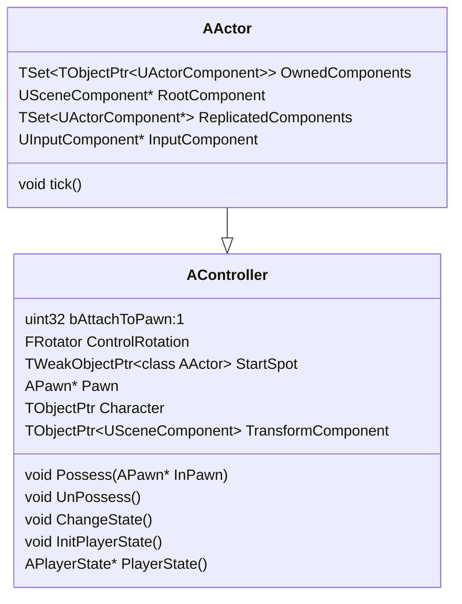
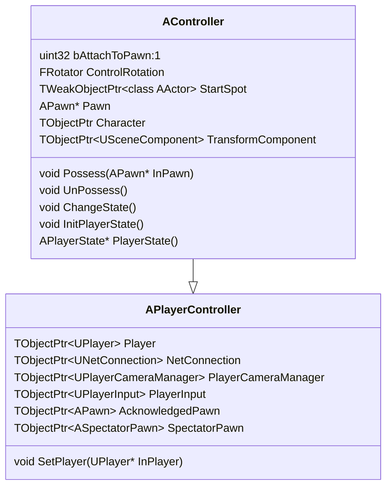
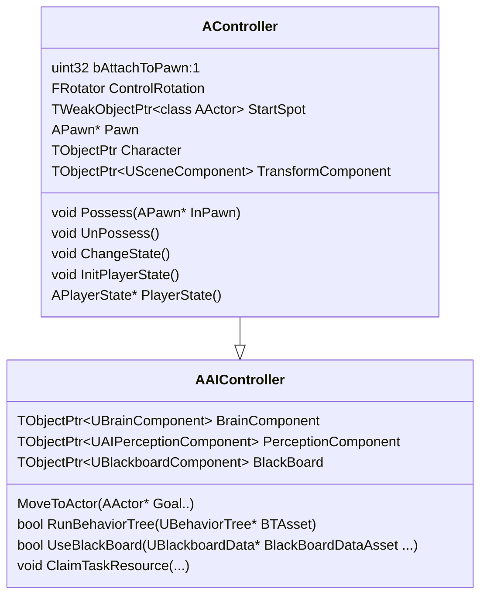
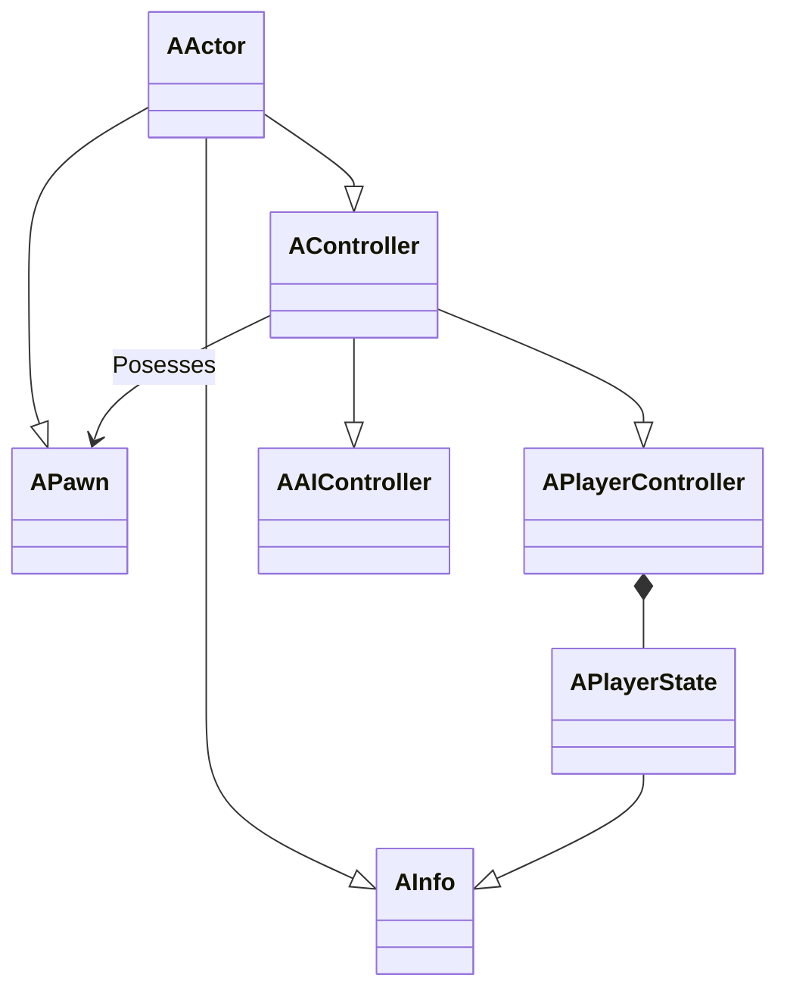
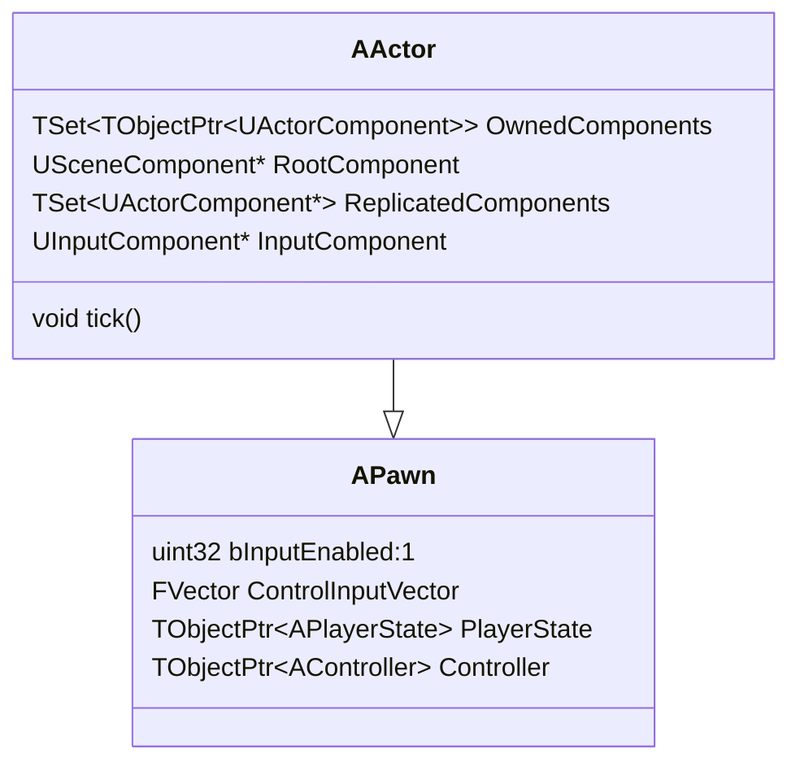
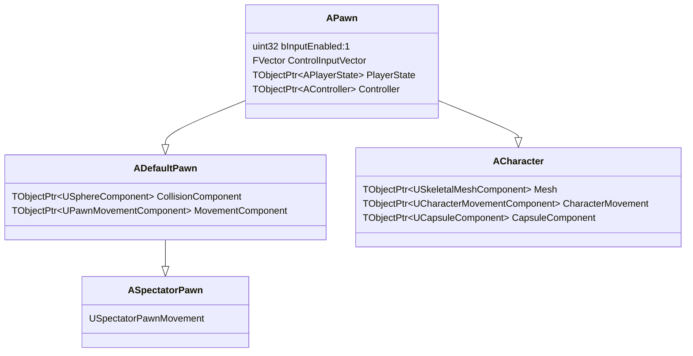
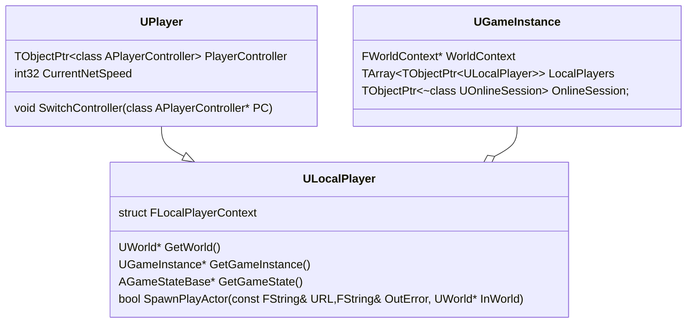
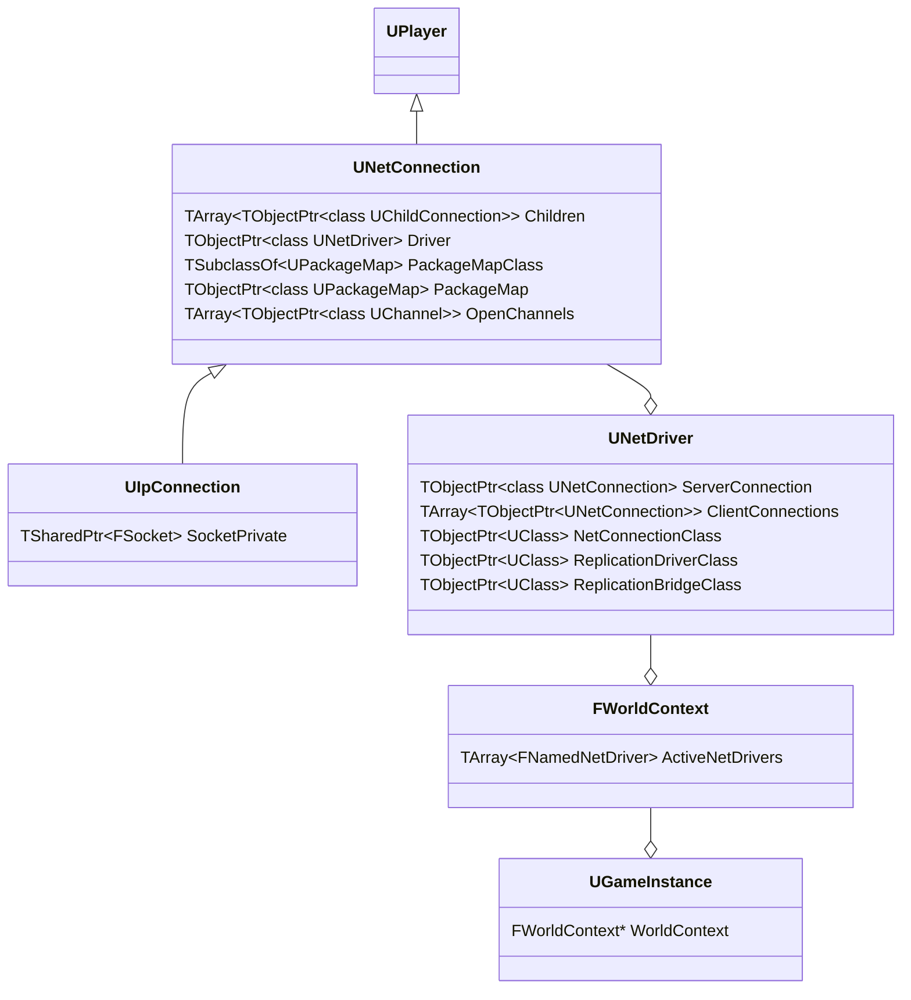

## Controllers Players Pawns

With a foundational understanding of the `AActor` architecture, the next layer in the gameplay system hierarchy delves into the relationship between `Controllers`, `Pawns`, and `Players`. In Unreal Engine, the `Entity Component` design of actors and components provides physical representation, rendering capabilities, and coordinate transformations for actors within the game world. However, another layer of abstraction is crucial for converting user inputs into actionable behavior for these actors. Unreal achieves this through the interaction between the `AController` and `APawn` classes.

The fundamental concept revolves around the `Possession` of pawns, which can be analogized as a mind-body relationship. Here, the `Controller` acts as the brain while the `Pawn` serves as the physical body. From a software design pattern perspective, this relationship bears resemblance to the `Observer Pattern`, where the controller observes and controls the pawn based on input and game logic. Alternatively, it can also be interpreted through the `Model View Controller (MVC)` pattern, where the pawn represents the model and the controller manages the interaction between the model (pawn) and the user input (view).

Personally, `APawn` and `AController` closely adhere to the `Observer` pattern, where the pawn represents a player entity within the game world, observed and controlled by the controller which listens to input events and modifies the pawn's state accordingly.
### AController

As indicated by the `A` prefix, the `AController` class inherits several mechanisms up the inheritance hierarchy:

- **UObject**: Provides capabilities such as reflection, serialization, and replication.
- **AActor/Components**: Allows for composition of additional functionality using actor components.

`AController` serves as the base class for all classes responsible for "Control", establishing foundational concepts crucial at the gameplay level for managing pawns:

1. **Control Relationship**: `AController` supports a `1:1` relationship for controlling pawns by default. If multiple pawns need simultaneous control, a programmer may derive a class to manage array of pawns associated with a single controller.

2. **Instancing**: Controller logic can be duplicated across multiple instances, each independent of the others, facilitating scalable and independent control logic.

3. **Coupling**: The relationship between controllers and pawns is loosely dependent, allowing controllers to possess or unpossess pawns selectively. This flexibility enables dynamic management of pawn lifecycles.

4. **Common Logic**: Controllers encapsulate game logic shared across all pawns they control, promoting efficient and centralized management of gameplay behaviors.

5. **Event Handling**: Controllers manage player input events and world events simplistically, and can also handle pawn-specific events if required, ensuring comprehensive event management capabilities.

6. **Consistent Data**: `AController` can maintain persistent state information for players, independent of pawn lifecycles. This feature is useful for data that needs to persist between gameplay sessions or transitions between game worlds.

7. **Networking**: Controllers are designed to function in networked environments, representing connections to game servers. They manage network authority, determining whether a player's actions are authoritative on the server or client side.

These characteristics make `AController` a versatile class for implementing player control systems in Unreal Engine, suitable for both single-player and multiplayer game scenarios.




The `AController` class cannot function as a component due to its need to exist independently of an actor. Inheriting directly from `UObject` is too low-level because `AActor` provides essential functionalities such as position management, actor components, input event handling, ticking, and network synchronization.

Derived classes such as `APlayerController` and `AIController` are typically spawned by the `GameMode`, leveraging its ability to specify default class information. Unreal Engine uses `StateName` to determine the current state of a controller, enabling the engine to manage different states and behaviors effectively.

```cpp
// UnrealNames.cpp
// Optimized replication.  
REGISTER_NAME(320,Playing)  
REGISTER_NAME(322,Spectating)  
REGISTER_NAME(325,Inactive)
```

```cpp
UPROPERTY(EditAnywhere, Category=Input)
TEnumAsByte<EAutoReceiveInput::Type> AutoReceiveInput;

UENUM()  
namespace EAutoReceiveInput  
{  
    enum Type : int  
    {  
       Disabled,  
       Player0,  
       Player1,  
       Player2,  
       Player3,  
       Player4,  
       Player5,  
       Player6,  
       Player7,  
    };
}

```

`AutoRecieveInput` is an enum used to automatically assign a player index to a controller for setting it up with a pawn at runtime. `APlayerController` is typically associated with a `LocalPlayer`, which can be active on a client or a listen server, or with remote players managed by `GameState` on a dedicated server.

**Controller Transform**

`AController` can have a `SceneComponent` attached to it, allowing it to store and manipulate world transform information. There are scenarios where a game programmer might need the controller to move independently of the pawn. For instance, when respawning a pawn at a specific location in the world where the controller is positioned, or creating a death camera. The position or rotation of the controller can be updated to move with the pawn by attaching or detaching it from the `SceneComponent` using the `bAttachToPawn` flag.

Unreal Engine provides a macro to hide actor transforms for actors that do not require them.

```cpp
    HIDE_ACTOR_TRANSFORM_FUNCTIONS();
```

In `APlayerController`, players require a camera to view the world. Therefore, the player controller includes a `PlayerCameraManager`, which ensures that players can still view the world even when they do not have a possessable pawn. In scenarios where no pawn is currently possessable, the `APlayerController` may create and possess a `ASpectatorPawn` to allow players to navigate and observe the game world.
### Game Logic for Controllers

- Functionality inherent to a `Pawn` includes basic actions such as movement, animation control, and collision handling. These fundamental behaviors are typically implemented directly within the Pawn itself. Conversely, a `Controller` focuses on determining where the Pawn should move, managing directional decisions, and overseeing replaceable or strategic logic applicable to multiple Pawns.

- Specific behaviors unique to a particular type of Pawn should be encapsulated within that Pawn's class. For example, in a military game featuring tanks and trucks as Pawns, only tanks possess the ability to fire weapons. Therefore, the firing mechanism would be implemented directly within the tank Pawn. However, functionalities that are shared among different types of Pawns, such as automatic target acquisition, are more suitably managed by the Controller.

- The lifecycle of a Controller surpasses that of any individual Pawn. This longevity is essential for managing persistent game elements like player resurrection after death. When a Pawn dies and is destroyed, all variables and states within it are reset. Thus, any logics or states that need to persist beyond a Pawn's lifespan should be handled by the Controller. This approach ensures consistency in gameplay experiences and facilitates the management of overarching game state and logic.

## APlayerController

The next level in the Controller hierarchy is the `APlayerController`. The goal of the `PlayerController` is to handle inputs of various Hardware interface Devices. You can imagine one player uses a gamepad, another player uses a mouse/keyboard so individually Instancing `PlayerControllers` for each `Pawn`  in a split screen can be mapped differently for each player in a game. This can be expanded upon to do things like associate an individual `Viewport` for each player, set input configuration and increase reusability. In networked games this is expanded further upon where `APlayerController` can only control its own local client `Pawns`. The server controls simulated `Pawns`  which exist as remote clients connected to a server. `UNetConnection` is part of a player controller holds a `NetDriver` which manages the game network traffic. Likewise `UNetConnection` derives from `UPlayer` which is used to swap out networked `PlayerControllers` which is associated with a specific player.




The `APlayerController` serves as the next tier in the Controller hierarchy. Its primary role is to manage inputs from various hardware interface devices, accommodating different player preferences such as gamepads, keyboards, or mice. In scenarios like split-screen gameplay, where multiple players interact with different Pawns simultaneously, each `PlayerController` instance can be uniquely tailored to map inputs for each player. This customization extends to configuring individual viewports, input settings, and enhancing overall reusability across different gameplay scenarios.

In networked environments, the responsibilities of `APlayerController` expand further. Each `APlayerController` exclusively manages local client Pawns, ensuring that input commands are processed only for the player's own interactions. Conversely, simulated Pawns are controlled by the server, managing remote clients connected to the game session. Underlying this network management is the `UNetConnection`, which encapsulates a `NetDriver` responsible for handling game network traffic. `UNetConnection` derives from `UPlayer`, facilitating the seamless swapping of networked `PlayerControllers` associated with specific players as they interact within the game environment.

### AIController

The `AIController` class parallels the functionality of `APlayerController` but with key distinctions. It omits features such as player inputs, camera management, HUD display, and player-specific functionalities like level switching. Instead, `AIController` introduces specialized components like the navigation mesh, essential for guiding AI-controlled entities through the game environment.

Looking forward, the field of AI in games is advancing, with increasing integration of machine learning algorithms to enhance AI behaviors. While current systems may not yet fully leverage these advanced techniques, foundational components within `AIController` offer entry points for implementing movement, pathfinding, and decision-making processes. Notably, systems like the Environment Query System (EQS) provide AI agents with tools to analyze their surroundings and make informed decisions based on perceptual data.

While the detailed exploration of AI and related systems isn't covered here, this foundational understanding of the `AIController` system sets the stage for further exploration into integrating AI agents controlled by evolving technologies such as machine learning algorithms in future game development endeavors.



As for the member fields of `AAIController`, there are several key features to highlight:

- **Task System**: AI in Unreal Engine utilizes a task system that integrates with the Gameplay Ability System. This allows for complex procedural tasks to be programmed for AI agents. Combined with the Environment Query System (EQS), AI can dynamically determine and execute tasks based on the game's logic.
    
- **Navigation**: Navigation is critical for pathfinding in AI controllers. The `MoveTo` interface is essential here, providing instructions on how AI should navigate from one point to another without direct input. The EQS further enhances navigation by allowing AI to perceive and navigate around obstacles, prioritizing tasks along predefined paths as per the game design.
    
- **AI Components**: To interact with the Behavior Tree, AI controllers utilize components like `BrainComponent` and `BlackboardComponent`. These components store and manage data used in decision-making processes within the AI's Behavior Tree, enabling complex decision-making based on environmental stimuli and game logic.
    

Deciding where to write AI code involves considering whether to use existing AI systems provided by Unreal Engine or integrating custom solutions. Since `AAIController` is an actor, additional tools and functionalities might be better modularized into actor components rather than being solely implemented within the controller itself.

Regarding data lifecycle management for AI agents:

- **Player Controller Specific Data**: For data specific to AI agents that are analogous to player states, it's preferable to manage them within the `PlayerState` class.
- **Higher-Level Data**: Data that needs to be accessible at a broader scope, such as across levels, can be referenced within the `GameState`.
- **Game Instance**: For data that needs to persist across different game sessions or worlds, the `GameInstance` serves as a suitable container.

### APlayerState

`PlayerState` serves a crucial role in storing player-specific information, both networked and local. It encapsulates data that would typically be part of the `PlayerController` but needs to be replicated over the network. Since the `PlayerController` is tied to a specific player, maintaining a reference to `PlayerState` ensures coherence between the player's game state and their interaction within the game.

Inheritance from `AInfoActor` is logical for `APlayerState` because it operates as a data container, devoid of gameplay logic. This aligns with its purpose to represent a player within the game. `APlayerState` instances are created in the level where `AController` references are defined, facilitating access to player state information for AI or other systems that require it. This setup is particularly useful during server disconnections and reconnections, ensuring that player state persists and is restored correctly upon client reconnection.

From the perspective of a gameplay programmer, `PlayerState` should exclusively handle player-specific information. All logic related to managing player data, such as scores, inventory, or player settings, belongs in `PlayerState`. Other aspects of game state that are not player-specific should reside in `GameState`, while broader, session-wide data can be managed by `GameInstance`.

## Controller Summary




Controllers is another piece of the large puzzle of Unreal game design. It's role within a level and the game mode by managing player inputs, networking aspects, AI behavior serve as the bridge between player actions and the game world, orchestrating how players interact with and perceive their game environment. This includes handling input devices, managing the movement and behavior of pawns (both player-controlled and AI-controlled), and ensuring that networked gameplay remains synchronized across clients and servers.

## APawn

`APawn` is fairly straight forward it's the next level in the hierarchy of `AActor` where additional logic is added to handle player input. 




1. Controller
2. Physical Representation
3. Movement Inputs

Since the engine originates from the FPS genre, the legacy of the players representation is rooted in the `Pawn` class. At this level, the class holds everything necessary to manage basic physics collisions, movement input, and logic between a controller. Unreal Engine has since evolved significantly, introducing the `EnhancedInput` system, which notably enhances the flexibility in handling input states based on various gameplay interactions. `AActor` manages the input interface with an `InputComponent`. Given that `APlayerController` is derived from `AActor`, this abstraction is well-suited. One can also envision scenarios where a data actor, without a physical representation, may still need to handle inputs.

The diagram provides a high-level visual description of the Input API and how it processes per tick across different systems.

![[InputAPI.png]](https://github.com/staticJPL/Unreal-Engine-Documentation/blob/bd49898f2e7da0e8dc333ac1dffad57415d8d150/Unreal%20Engine%20Gameplay%20Architecture/Diagrams/InputAPI.png)

As per the diagram the input is first handled by `FSlateApplication` then moves through to the `Input Processors`. 

```cpp
void AController::Possess(APawn* InPawn)
{
    if (!bCanPossessWithoutAuthority && !HasAuthority())
    {
        FMessageLog("PIE").Warning(FText::Format(
            LOCTEXT("ControllerPossessAuthorityOnly", "Possess function should only be used by the network authority for {0}"),
            FText::FromName(GetFName())
        ));
        UE_LOG(LogController, Warning, TEXT("Trying to possess %s without network authority! Request will be ignored."), *GetNameSafe(InPawn));
        return;
    }

    REDIRECT_OBJECT_TO_VLOG(InPawn, this);

    APawn* CurrentPawn = GetPawn();

    // A notification is required when the current assigned pawn is not possessed (i.e. pawn assigned before calling Possess)
    const bool bNotificationRequired = (CurrentPawn != nullptr) && (CurrentPawn->GetController() == nullptr);

    // To preserve backward compatibility we keep notifying derived classed for null pawn in case some
    // overrides decided to react differently when asked to possess a null pawn.
    // Default engine implementation is to unpossess the current pawn.
    OnPossess(InPawn);

    // Notify when pawn to possess (different than the assigned one) has been accepted by the native class or notification is explicitly required
    APawn* NewPawn = GetPawn();
    if ((NewPawn != CurrentPawn) || bNotificationRequired)
    {
        ReceivePossess(NewPawn);
        OnNewPawn.Broadcast(NewPawn);
        OnPossessedPawnChanged.Broadcast(bNotificationRequired ? nullptr : CurrentPawn, NewPawn);
    }

    TRACE_PAWN_POSSESS(this, InPawn);
}

```

```cpp
void AController::OnPossess(APawn* InPawn)
{
    const bool bNewPawn = GetPawn() != InPawn;

    // Unpossess current pawn (if any) when current pawn changes
    if (bNewPawn && GetPawn() != nullptr)
    {
        UnPossess();
    }

    if (InPawn == nullptr)
    {
        return;
    }

    if (InPawn->Controller != nullptr)
    {
        UE_CLOG(InPawn->Controller == this, LogController, Warning, TEXT("Asking %s to possess pawn %s more than once; pawn will be restarted! Should call Unpossess first."), *GetNameSafe(this), *GetNameSafe(InPawn));
        InPawn->Controller->UnPossess();
    }

    InPawn->PossessedBy(this);
    SetPawn(InPawn);

    // update rotation to match possessed pawn's rotation
    SetControlRotation(Pawn->GetActorRotation());

    Pawn->DispatchRestart(false);
}
```

The possession code is fairly straightforward: `AController` calls `Possess` with a `Pawn` reference, then invokes `OnPossess` to establish the relationship between the controller and pawn in memory. `DispatchRestart` completes the process by configuring the `MovementComponent` used for the pawn.



Unreal Engine provides a couple of additional classes that can be utilized:

- **DefaultPawn**: If you prefer not to constantly inherit from `Pawn`, `DefaultPawn` serves as a good starting point. However, for more customized movement systems, `APawn` is typically the class of choice.

- **SpectatorPawn**: In FPS games, spectators can observe an active game. This object is unaffected by gravity, lacks collision capabilities (no clipping), and includes a camera.

## UPlayer

At a gameplay level in Unreal Engine, it's crucial to distinguish between a `LocalPlayer` and a `Network Player`. `UPlayer`, being directly derived from `UObject`, isn't tied to a specific Level and doesn't need to inherit from `AActor` if its mode persists across levels. `UPlayer` is linked with a `PlayerController` because both `LocalPlayer` and `NetworkPlayers` require control over `APawn`. Therefore, it's logical for `UPlayer` to be associated with a `PlayerController`.

#### ULocalPlayer

The `GameInstance` stores all the local players for the game session, each of which requires a `PlayerController` to handle input and subsequently possess a `Pawn`.

```cpp
class APlayerController;

UCLASS(MinimalAPI, transient, config=Engine)
class UPlayer : public UObject, public FExec
{
    GENERATED_UCLASS_BODY()

    /** The actor this player controls. */
    UPROPERTY(transient)
    TObjectPtr<class APlayerController> PlayerController;

    // Net variables.
    /** the current speed of the connection */
    UPROPERTY()
    int32 CurrentNetSpeed;

    /** @todo document */
    UPROPERTY(globalconfig)
    int32 ConfiguredInternetSpeed;

    /** @todo document */
    UPROPERTY(globalconfig)
    int32 ConfiguredLanSpeed;

public:
    //~ Begin FExec Interface.
#if UE_ALLOW_EXEC_COMMANDS
    ENGINE_API virtual bool Exec(UWorld* InWorld, const TCHAR* Cmd, FOutputDevice& Ar) override;
#endif
    //~ End FExec Interface.

    /** 
     * Dynamically assign Controller to Player and set viewport.
     * 
     * @param PC - new player controller to assign to player
     */
    ENGINE_API virtual void SwitchController(class APlayerController* PC);

    /** 
     * Executes the Exec() command
     * 
     * @param Command command to execute (string of commands optionally separated by a | (pipe))
     * @param bWriteToLog write out to the log
     */
    ENGINE_API FString ConsoleCommand(const FString& Cmd, bool bWriteToLog = true);

    /** 
     * Gets the player controller in the given world for this player.
     * 
     * @param InWorld The world in which to search for player controllers.
     * 
     * @return The controller associated with this player in InWorld, if one exists.
     */
    ENGINE_API APlayerController* GetPlayerController(const UWorld* const InWorld) const;

    /** 
     * Called when this player has had its outer Player Controller set for remote net connections
     */
    ENGINE_API virtual void ReceivedPlayerController(APlayerController* NewController);
};

```

The `UPlayer` class is relatively lightweight and concise, containing helper functions for switching `PlayerControllers` for a player, including retrieving the specific `PlayerController` currently active in the world.


`SpawnPlayActor` is invoked by the `GameInstance` to spawn `PlayerControllers` once all local players have been determined. If you recall from the `AActor` lifecycle section, when starting a game in the Play-In-Editor (PIE) mode, a `GameInstance` is instantiated, which then creates a `GameViewport`. The `GameViewport` (`FViewport`) serves as the abstract interface for platform-specific rendering, audio, and input. There is exactly one `GameViewportClient` per game instance, though split-screen games may have multiple viewports. The key takeaway is that when the `GameViewportClient` is created, it is passed to `CreateLocalPlayer`.

```cpp
ULocalPlayer* UGameInstance::CreateLocalPlayer(FPlatformUserId UserId, FString& OutError, bool bSpawnPlayerController)
{
    [...]
    
    NewPlayer = NewObject<ULocalPlayer>(GetEngine(), GetEngine()->LocalPlayerClass);
    InsertIndex = AddLocalPlayer(NewPlayer, UserId);
    UWorld* CurrentWorld = GetWorld();
    if (bSpawnPlayerController && InsertIndex != INDEX_NONE && CurrentWorld != nullptr)
    {
        if (CurrentWorld->GetNetMode() != NM_Client)
        {
            // server; spawn a new PlayerController immediately
            if (!NewPlayer->SpawnPlayActor("", OutError, CurrentWorld))
            {
                RemoveLocalPlayer(NewPlayer);
                NewPlayer = nullptr;
            }
        }
        else if (CurrentWorld->IsPlayingReplay())
        {
            if (UDemoNetDriver* DemoNetDriver = CurrentWorld->GetDemoNetDriver())
            {
                // demo playback; ask the replay driver to spawn a splitscreen client
                if (!DemoNetDriver->SpawnSplitscreenViewer(NewPlayer, CurrentWorld))
                {
                    RemoveLocalPlayer(NewPlayer);
                    NewPlayer = nullptr;
                }
            }
        }
        else
        {
            // client; ask the server to let the new player join
            TArray<FString> Options;
            NewPlayer->SendSplitJoin(Options);
        }
    }
    
    [...]
}

```

Drawing attention to the code snippet, `ULocalPlayer` is created first, followed by the `PlayerController` if in `ServerMode`.

```cpp
void APlayerController::PostInitializeComponents()  
{  
    Super::PostInitializeComponents();  
  
    if ( IsValid(this) && (GetNetMode() != NM_Client) )  
    {  
	    // create a new player replication info  
       InitPlayerState();  
    }  
    SpawnPlayerCameraManager();  
    ResetCameraMode();   
    if ( GetNetMode() == NM_Client )  
    {      
		SpawnDefaultHUD();  
    }  
    AddCheats();  
  
    bPlayerIsWaiting = true;  
    StateName = NAME_Spectating; 
    
	// Don't use ChangeState, because we want to defer spawning the SpectatorPawn until the Player is received  
}
```

When `PostInitalizeComponents` is fired after the C++ constructor. `InitPlayerState` is what actually sets up the `PlayerState`.

```cpp
void AController::InitPlayerState()
{
	if (GetNetMode() != NM_Client)
	{
		UWorld* const World = GetWorld();
		const AGameModeBase* GameMode = World ? World->GetAuthGameMode() : nullptr;

		// If the GameMode is null, this might be a network client that's trying to
		// record a replay. Try to use the default game mode in this case so that
		// we can still spawn a PlayerState.
		if (GameMode == nullptr)
		{
			const AGameStateBase* const GameState = World ? World->GetGameState() : nullptr;
			GameMode = GameState ? GameState->GetDefaultGameMode() : nullptr;
		}

		if (GameMode != nullptr)
		{
			FActorSpawnParameters SpawnInfo;
			SpawnInfo.Owner = this;
			SpawnInfo.Instigator = GetInstigator();
			SpawnInfo.SpawnCollisionHandlingOverride = ESpawnActorCollisionHandlingMethod::AlwaysSpawn;
			SpawnInfo.ObjectFlags |= RF_Transient; // We never want player states to save into a map

			TSubclassOf<APlayerState> PlayerStateClassToSpawn = GameMode->PlayerStateClass;
			if (PlayerStateClassToSpawn.Get() == nullptr)
			{
				UE_LOG(LogPlayerController, Log, TEXT("AController::InitPlayerState: the PlayerStateClass of game mode %s is null, falling back to APlayerState."), *GameMode->GetName());
				PlayerStateClassToSpawn = APlayerState::StaticClass();
			}

			PlayerState = World->SpawnActor<APlayerState>(PlayerStateClassToSpawn, SpawnInfo);

			// Force a default player name if necessary
			if (PlayerState && PlayerState->GetPlayerName().IsEmpty())
			{
				// Don't call SetPlayerName() as that will broadcast entry messages but the GameMode hasn't had a chance
				// to potentially apply a player/bot name yet
				PlayerState->SetPlayerNameInternal(GameMode->DefaultPlayerName.ToString());
			}
		}
	}
}

```

This is where the `LocalPlayer` is set up. When connecting to a network, the `PlayerState` for other players, as previously mentioned, will be replicated to the client.

```cpp
void APlayerController::SetPlayer(UPlayer* InPlayer)
{
	FMoviePlayerProxyBlock MoviePlayerBlock;
	check(InPlayer != nullptr);

	const bool bIsSameLevel = InPlayer->PlayerController && (InPlayer->PlayerController->GetLevel() == GetLevel());
	// Detach old player if it's in the same level.
	if (bIsSameLevel)
	{
		InPlayer->PlayerController->Player = nullptr;
	}

	// Set the viewport.
	Player = InPlayer;
	InPlayer->PlayerController = this;

	// Cap outgoing rate to max set by server
	UNetDriver* Driver = GetWorld()->GetNetDriver();
	if (ClientCap >= 2600 && Driver && Driver->ServerConnection)
	{
		Player->CurrentNetSpeed = Driver->ServerConnection->CurrentNetSpeed = FMath::Clamp(ClientCap, 1800, Driver->MaxClientRate);
	}

	// Initializations only for local players
	ULocalPlayer* LP = Cast<ULocalPlayer>(InPlayer);
	if (LP != nullptr)
	{
		// Clients need this marked as local (server already knew at construction time)
		SetAsLocalPlayerController();
		LP->InitOnlineSession();
		InitInputSystem();
	}
	else
	{
		NetConnection = Cast<UNetConnection>(InPlayer);
		if (NetConnection)
		{
			NetConnection->OwningActor = this;

#if UE_WITH_IRIS
			UpdateOwningNetConnection();
			UE::Net::FReplicationSystemUtil::UpdateSubObjectGroupMemberships(this);
#endif // UE_WITH_IRIS
		}
	}

	UpdateStateInputComponents();

#if ENABLE_VISUAL_LOG
	if (GetLocalRole() == ROLE_Authority && FVisualLogger::Get().IsRecordingOnServer())
	{
		OnServerStartedVisualLogger(true);
	}
#endif

	// Notify script that we've been assigned a valid player
	ReceivedPlayer();
}

```

`InitInputSystem` creates the `PlayerInput` and its components.
#### UNetConnetion

`UNetConnection` is very important for any multiplayer programmer as it represents the network layer exposed to a player. Details about the `NetDriver` and lower-level networking stack are beyond this scope, but it's important to understand that a player can be conceptualized as a `Connection` through `UNetConnection`.



`IpConnection` holds the `SocketPrivate` for a player, which can be accessed through a getter function. While there are platform-specific `IpConnection` derived types in the engine, it serves as a starting point for exposing custom sockets for specific purposes if needed.

Lastly, `UNetConnection` objects are integrated into the `NetDriver`, which itself is part of the `WorldContext` within the `GameInstance`. This positioning underscores that `UPlayer` exists at a higher layer within the world structure.

### Summary

Unreal Engine abstracts the concept of a player into two categories: `LocalPlayer` and `NetConnection`, which originates from its early FPS engine roots and remains effective today. `UPlayer` acts as a concrete entity managing player control, player state, and roles in both local and networked contexts. It serves as a lightweight layer defining player connectivity within the game world, designed to avoid containing complex gameplay logic.
