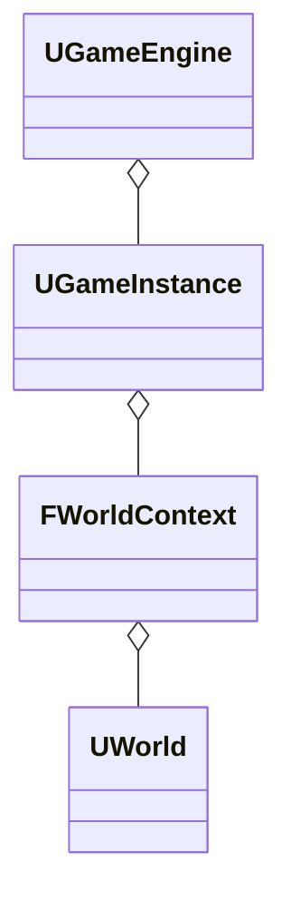
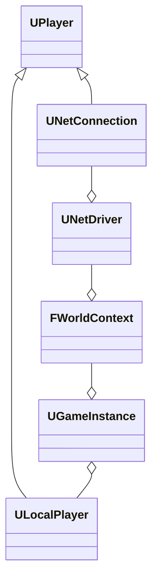
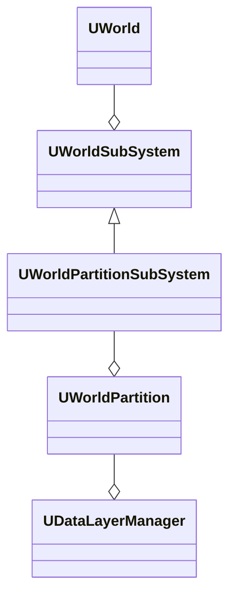
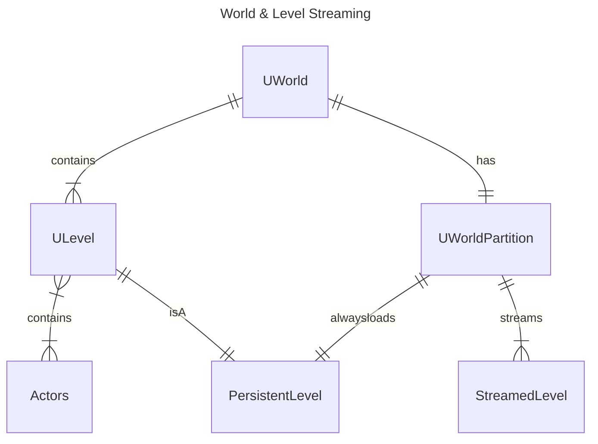
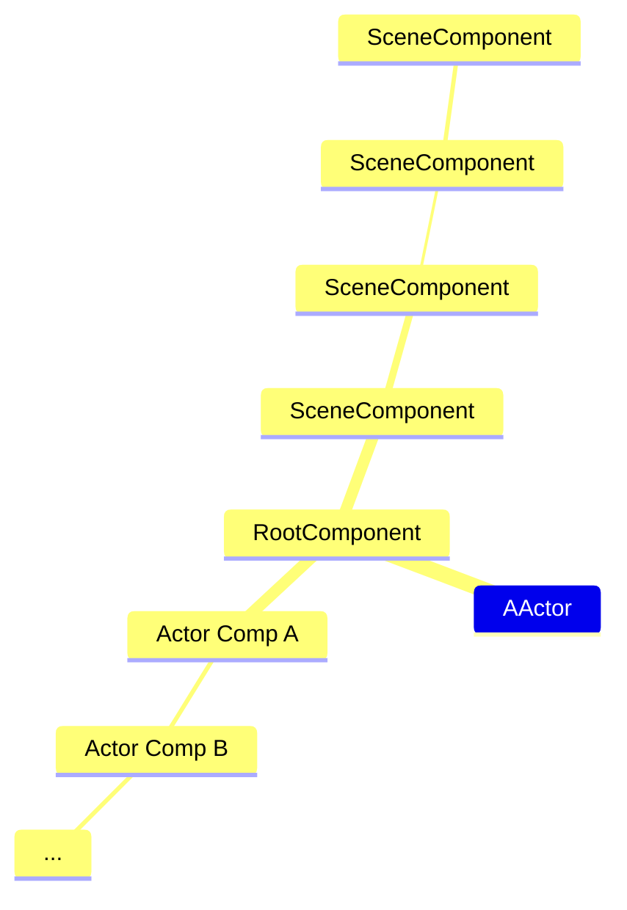
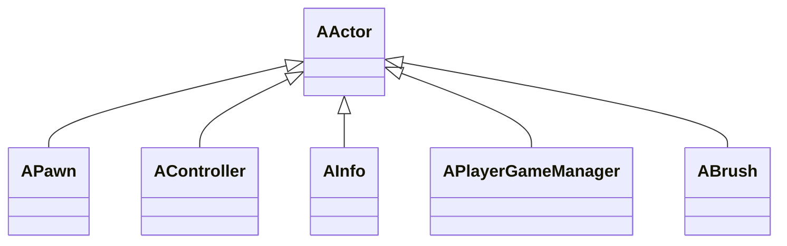

## Gameplay Architecture Summary

This section consolidates gameplay systems to organize and provide a high-level perspective on their structure and data flow.

## Game Engine World & Players

Starting from the top, when the Engine creates `UWorld` objects, it first initializes the `WorldContext` during Editor or Game startup. The primary role of the `WorldContext` is to manage transitions between different worlds, alongside maintaining context for switching out a `PersistentLevel`.

The `GameInstance` is overseen by the engine object and serves as a container for the `World` and `Players` (Local and Net Connection) that require access to the world.

 Below is the `GameInstance` the UML relationship with the `Players`

In addition, `UWorld` holds several subsystems, with one of the most relevant subsystems in UE5 being `WorldPartition`. The world partition system serves as a direct replacement for `WorldComposition` and manages `LevelStreaming` within a spatial grid system.

The subsystem structure is described below

When a world is constructed in Unreal Engine, players are abstracted through `UPlayer`, which is a subclass of `UObject`. This object is responsible for managing different player modes and controls aspects such as the number of `PlayerControllers` present in the world and the conditions under which they are generated.
## Levels Actors & Controllers

`UWorld` contains `ULevels`, and each `ULevel` contains `AActors`. The `PersistentLevel` serves as the root of the `WorldPartition` system. Within `WorldPartition`, a hashed grid system segregates levels into cells to facilitate spatial level streaming for `AActors`.

![[Unreal Engine Gameplay Architecture/Diagrams/WorldPartitionGridCell.png]](https://github.com/staticJPL/Unreal-Engine-Documentation/blob/ac834df1614a0c9d807af7e2ee85dcb1646f61b3/Unreal%20Engine%20Gameplay%20Architecture/Diagrams/WorldPartitionGridCell.png)

`ULevel` serves as the primary container responsible for serializing actors when they are placed within it. This level can accommodate various types of actors, including those related to rendering, data management, and gameplay.

`AGameMode` plays a crucial role in game initialization by creating actors, `PlayerControllers`, and establishing game rules. It works closely with `AGameState`, which acts as a data object supporting persistent game data during runtime.

`AActor` is a fundamental gameplay entity that exists within the Unreal Engine's `World`. It adheres to the `Entity Component` design pattern, where `ActorComponents` encapsulate low-level functionalities associated with an actor.

As `AActor` derives from `UObject`, it inherits capabilities such as serialization and networking. This allows actors to be saved and loaded from disk, as well as synchronized across a network during multiplayer gameplay.

`APawn` represents the next layer of logical control derived from `AActor`, specifically designed to handle:

1. **Control**: `APawn` is responsible for receiving input from players or AI controllers, allowing them to interact with the game world.
    
2. **Physical Movement**: This includes managing movement within the game world, involving tasks such as collision detection and physics simulation.
    
In essence, `APawn` extends the functionality of `AActor` by incorporating features crucial for interactive and physically simulated entities within Unreal Engine.
## Gameplay Framework

Several gameplay objects are created and destroyed throughout the runtime of a game, each handled by specific classes responsible for game logic:

1. **GameInstance**: Created in standalone games during `UGameEngine::Init`, or for PIE in `UEditorEngine::CreateInnerProcessPIEGameInstance`.
    
2. **GameMode**: Created by `GameInstance` when the engine loads a map.
    
3. **GameSession**: Created by `GameMode` within `AGameModeBase::InitGame`.
    
4. **GameNetworkManager**: Created by `GameMode` within `AGameModeBase::PreInitializeComponents`.
    
5. **PlayerController**: Created by `GameMode` after a successful login, initiated by `GameMode` calling `Login`. This process cascades down to `AGameModeBase::SpawnPlayerController`, which in turn calls `UWorld::SpawnPlayActor` for hard travel to levels. During seamless travel, if the `GameMode` is subclassed and the `PlayerController` remains the same before travel, the existing `PlayerController` is retained; otherwise, a new one is created within `AGameModeBase::HandleSeamlessTravelPlayer`.
    
6. **SpectatorPawn**: Created by `PlayerController` when `APlayerController::SpawnSpectatorPawn` is invoked. This function is triggered by `PlayerController` through `BeginSpectatingState`, called either by `APlayerController::ReceivedPlayer` or by `AGameModeBase::HandleSeamlessTravelPlayer` during seamless travel.
    
7. **PlayerState**: Instantiated by `PlayerController` using `AController::InitPlayerState` during `APlayerController::PostInitializeComponents`.
    
8. **Pawn**: Created by `GameMode` within `AGameModeBase::RestartPlayer`, initiated from `AGameModeBase::HandleStartingNewPlayer`, either through `AGameMode::PostLogin` for hard travels or `AGameModeBase::HandleSeamlessTravelPlayer` during seamless travel.
    

These classes and their instantiation processes are crucial for managing gameplay mechanics and state within Unreal Engine.

- **GameMode**, **GameSession**, **GameNetworkManager**, and **AIController** exist exclusively on the server.
    
- **GameInstance** and **GameState** exist on both the server and client. The former isn’t replicated, while the latter is.
    
- **PlayerState** and **Pawn** are replicated, existing on both the server and client for every autonomous and simulated proxy.
    
- **PlayerController** is replicated, existing on the server for every proxy and only on the owning client (autonomous proxy).
    
- **PlayerCameraManager** exists for every proxy on the server and only on the owning client, though it isn’t replicated.
    
- **SpectatorPawn** and **HUD** exist solely on the owning client.

### Gameplay Flow

![[Unreal Engine Gameplay Architecture/Diagrams/GamePlayFlow.svg]](https://github.com/staticJPL/Unreal-Engine-Documentation/blob/ac834df1614a0c9d807af7e2ee85dcb1646f61b3/Unreal%20Engine%20Gameplay%20Architecture/Diagrams/GamePlayFlow.svg)

The gameplay flow diagram illustrates different layers segregated by the "Gameplay Core," which defines the containers and entities composing the game world. "Gameplay Logic" encompasses player logic where inputs are passed, possession is defined, and rules for gameplay and handling world transitions are established. "Gameplay Data" defines persistent data used by the "Gameplay Logic."

### Gameplay UML

The following UML fully illustrates the entire gameplay architecture.

![[Unreal Engine Gameplay Architecture/Diagrams/GameplayFinalUML.svg]](https://github.com/staticJPL/Unreal-Engine-Documentation/blob/ac834df1614a0c9d807af7e2ee85dcb1646f61b3/Unreal%20Engine%20Gameplay%20Architecture/Diagrams/GameplayFinalUML.svg)

## Conclusion

This concludes the "Gameplay Architecture" series. The aim throughout has been to provide a comprehensive reference and foster a deeper understanding of the entire architecture. This understanding is crucial for making informed decisions when crafting game logic, and it also lays a solid foundation for venturing into multiplayer game development.

I've invested considerable time exploring various resources, studying source code, debugging, and seeking answers to formulate each layer that I believe would benefit a gameplay programmer. If you've followed through from the previous sections on "Unreal Engine Reflection System" and "Unreal Engine UObject Construction & Post Initialization," you should now have a robust starting point to develop incredible gameplay systems.

As others delve into this realm, I encourage them to share their experiences and knowledge, just as I have done. Together, we can continue to enrich the community's understanding and capabilities in game development with Unreal Engine.
